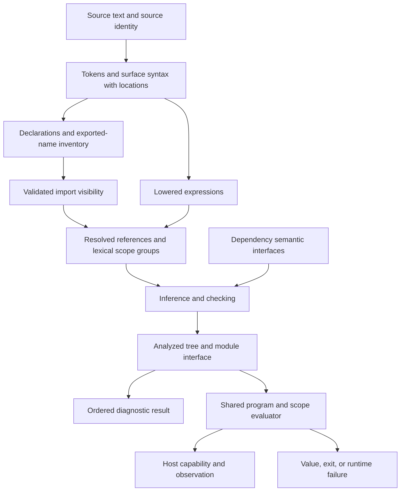

# Compiler architecture remediation implementation plan

> Execute inline, task by task, using the executing-plans workflow. This document proposes implementation; its creation does not start compiler changes. If delegation is subsequently requested, the user's restriction is GPT-5.6-Luna at Max reasoning only.

**Goal:** Reduce the compiler's architectural complexity by giving binding identity, lexical scope, module interfaces, checked expressions, and runtime scope execution one authoritative owner each, while preserving current language and CLI behavior.

**Architecture:** Retain the phase-indexed Haskell core and current interpreter. Resolve declaration identity and lexical structure once; typecheck into an analyzed tree whose semantic facts are sufficient for direct execution. Use one program path for standalone/module inputs and one complete semantic interface per analyzed module. Remove the positional prelude protocol, dependency sidecars, semantic reattachment database, and duplicated lexical execution rules as their replacements become authoritative.

**Tech stack:** Haskell, GHC 9.14.1 through the repository Nix development shell, Cabal, Megaparsec, `containers`, existing test harness and `jazz-bench`. No new dependency is planned.

**Spec:** [Validated audit findings](2026-09-10-compiler-architecture-validation.md), together with the target contracts and preservation rules below. The report preserves the disposition of all three input audits. The two Luna drafts were withdrawn after validation; their rejected or qualified recommendations are not implementation guidance.

**Status:** Execution requested on 2026-09-11. T13 is the active bounded milestone in the execution queue. Execute the remaining tasks inline in dependency order; promote the next milestone when its prerequisites pass.

**Existing architecture decision:** [RFC 0016](../../rfcs/accepted/0016-optional-backend-removal.md) explicitly says to keep “attached analysis facts, and runtime plans.” Direct construction still retains attached facts, but T11a proposes changing the retained runtime-plan contract. Approval of this plan should therefore include that specific architectural decision and a narrow amendment through the repository's RFC process before removal. This is a dependency of T11a, not a reason to block unrelated tasks or ask for another confirmation while preparing this plan. If runtime plans are to remain, retain the small sequence and pursue direct identity/ownership improvements around it; do not claim its deletion completed.

**Baseline:** `2695289b1e9a7555855eb6b00147a478ae010c6d`, the main-branch source revision before this documentation work. Compiler sources remain identical to that revision. Refresh the diff and tests if implementation begins from a newer checkout.

## Global constraints

**Verification override (2026-09-11):** Do not run benchmark or performance tests until the ENTIRE plan is complete. This includes opt-in hosted resource-statistics and parser scale runs. Use focused correctness suites throughout the remaining implementation tasks.

1. Preserve accepted syntax, diagnostic codes/severity/order/locations, export visibility, type inference and generalization, numeric semantics, evaluation order/laziness, host traces, explicit exit, and CLI result projections.
2. Preserve current rebinding and recursive-group semantics, including nearest earlier declarations, interleaved groups, conditional callable aliases, nested pattern scope, and declaration-site capture. No blanket recursive `let` semantics and no ban on rebinding.
3. Preserve standalone, named-module, and prelude source ownership. Dependency expression statements are checked but skipped during dependency evaluation. Prelude statements retain their own locations and warning policy.
4. Preserve inspectable analyzed types, schemes, numeric constraints, selected operations, and evidence. A field being unread by the interpreter is insufficient reason to delete a checked-analysis contract.
5. Keep module graph smart-constructor guarantees, namespace distinctions, ordered quantification, runtime exit/failure distinctions, and source-span diagnostics.
6. No new backend, generic optimization/pass framework, serialized interface cache, effect framework, trait language, package/reexport system, hosted compiler rewrite, or grammar redesign. Existing hosted parity tests remain regression gates; deferred hosted feature work stays deferred. The canonical `Lowered` schema is unchanged by internal resolved/analyzed normalization.
7. Implement in active `src/`, `app/`, `test/`, and, only if existing compatibility fixtures require it, `jazz/`. Keep plans under `.codex/plans/`. Do not use implementation plans to redefine public language behavior.
8. Keep each migration shippable. Temporary adapters must have one named caller/migration purpose and be removed in the task that retires their last consumer. Do not leave two selectable compiler architectures behind a permanent flag.
9. Tests should establish behavior or a meaningful boundary invariant. Reuse existing suites; add cases only for uncovered distinctions. Do not preserve assertions about an obsolete internal map merely because the old test asserted it.
10. Commit completed, validated slices. No net line-count quota: record actual removals and replacement costs. A refactor that just renames/moves plumbing has not achieved its deletion criterion.

## Target architecture and concrete contracts



Tokens and surface syntax are temporary frontend products. Discovery may traverse the surface tree once before discarding it. Solver tables are private to checking. There is no additional whole-program executable IR between the analyzed tree and interpreter.

### Ownership contracts

| Concept                        | Authoritative owner                                                                | Contract for consumers                                                                                                                                                                          |
| ------------------------------ | ---------------------------------------------------------------------------------- | ----------------------------------------------------------------------------------------------------------------------------------------------------------------------------------------------- |
| Source identity/location       | `ModuleIdentity`, source spans, parser node construction                           | Semantic phases receive locations and owners; they never find a name's location by rescanning tokens.                                                                                           |
| Exported names before checking | Existing `ModuleExportInventory` from discovery                                    | Resolver can validate imports before typed interfaces exist. This is deliberately a different product from a typed interface.                                                                   |
| Import visibility              | A validated import scope produced in `src/Jazz/Compiler/ModuleResolver/Imports.hs` | Carries namespace-aware imported targets, aliases, import origins, and spans. Names and typed import selection consume this result instead of reimplementing exposure rules.                    |
| Binding identity               | Resolution, using declaration/pattern/lambda nodes                                 | References carry the declaration ID they select. Display names and diagnostic origin remain separate from identity. Builtins retain their catalog identity.                                     |
| Lexical scope                  | Resolved block facts                                                               | Ordered declarations, visible-before relationships needed for rebinding, recursive group membership, and lexical capture candidates are computed once. Consumers use views of this one product. |
| Declaration meaning            | Declaration checking                                                               | Constructor templates, class/method signatures, implementation targets, and scheme binders use normalized semantic types and stable IDs. Raw signatures remain a frontend/diagnostic concern.   |
| Checked expression facts       | The inference operation checking that expression                                   | Returns a draft checked subtree; finalization substitutes solved types and validates completeness. It does not rediscover lexical binders or join six unrelated output maps.                    |
| Module semantic interface      | Successful module checking                                                         | Complete exported semantic declarations, binder identities, and evidence. An importer can typecheck from this artifact without a dependency body.                                               |
| Local module environment       | Module checking, retained privately as needed                                      | Includes private declarations required by exported types/method execution. Public projection is explicit and cannot publish private names accidentally.                                         |
| Runtime specialization         | Interpreter consuming analyzed facts                                               | Closed type applications, concrete method evidence, literal targets, and result constraints have one path. Genuinely unresolved polymorphic dispatch remains dynamic.                           |
| Runtime lexical execution      | Shared scope executor                                                              | Uses resolved scope groups and reference IDs. Cell state/value selection remain runtime concerns.                                                                                               |
| Diagnostics/outcomes           | Artifact queries, compiler coordinator, runtime boundary                           | Preserve ordered diagnostics on failed analysis, artifact-local diagnostics, normal completion, explicit exit, failure, and no execution.                                                       |

### Binding identity details

Use source-unit ownership plus the binder's declaration node identity, extending the existing identity types rather than inventing a symbol server. Source-unit identity distinguishes standalone/prelude/named units even if their display paths overlap. Pattern variables, `as` binders, lambda parameters, constructors, and method declarations use their own nodes; do not assign every binder in a declaration the same ID.

Resolved value uses identify a binder, builtin, or capability method directly. A capability-method reference identifies the class/method even when its implementation remains polymorphic and is selected later. Operator values refer to the selected operator declaration/builtin; spelling alone no longer causes a later lexical lookup. Keep authored spelling and origin for diagnostics. Unresolved uses may exist only in a diagnostic-producing intermediate result; successful analysis must not manufacture a current-module binding for them.

Type names and capability identities must also be module-stable. This does not require using a value-binder ID for every kind of name. Retain namespace-specific identities where they already express the distinction clearly.

### Analyzed execution details

Keep `Expr 'Analyzed` as the interpreter input. The four current `RuntimeObligation` constructors are derived from facts already available at analyzed nodes. Retire the stored `Seq RuntimeObligation` by consuming those facts at the relevant operation:

- Literals use their checked numeric target at construction.
- Explicit type applications use a checked instantiation target and ordered arguments. The target discriminates a lexical binder from a qualified method; it must not be recovered by inspecting expression spelling.
- Concrete evidence identifies the implementation/method directly. Calls with no statically selected implementation retain the existing dynamic specialization semantics.
- Return handling applies the checked result type's representation/defaulting rule and existing profile/continuation behavior. It does not require building and interpreting a second expression-wide sequence.

Preserve the current order: explicit instantiation, evidence restriction, literal specialization where relevant, result constraints. Higher-order function annotations and result policies remain until a replacement proves equivalent. Removing a runtime-plan type while storing the same instruction sequence under another name does not satisfy T11.

### Inference state details

Retain the existing solver, declaration, module, and output separation initially. Make speculation explicit with two distinct operations:

- **Preview:** restore the original semantic/output state while keeping the advanced fresh-variable watermark and returning the preview's temporary result separately.
- **Rejected pattern:** restore stable semantic state while preserving diagnostics from the failed attempt.

Other restoration operations, such as lexical capability scope restoration, remain separately named. Do not apply one generic transaction policy to all three.

The checked-tree migration uses a private draft form during solving, then finalizes it. Recursive groups may keep a temporary map keyed by declaration ID while members are solved. This is a private algorithm data structure with one owner, not an inter-phase database requiring consumers to reconstruct the tree.

## File responsibilities

Paths below are repository-relative; their existing implementations are indexed in the validation report. New files are limited to concrete ownership changes:

| Files                                                                                                                                                                               | Intended responsibility/change                                                                                                                                                                                                 |
| ----------------------------------------------------------------------------------------------------------------------------------------------------------------------------------- | ------------------------------------------------------------------------------------------------------------------------------------------------------------------------------------------------------------------------------ |
| `src/Jazz/Compiler/Parser/{AST,Declaration,Signature,CapabilityDeclaration,ModuleDeclaration,TokenParser,Lower}.hs`                                                                 | Preserve source locations and use one parser-control protocol.                                                                                                                                                                 |
| `src/Jazz/Compiler/ModuleResolver.hs`, `src/Jazz/Compiler/ModuleResolver/{Imports,Names}.hs`                                                                                        | Discovery product, validated import scope, and stable reference resolution.                                                                                                                                                    |
| New `src/Jazz/Compiler/CoreIdentity.hs`                                                                                                                                             | Move node/binder/implementation/method identity primitives out of semantic output definitions so early resolution can use them without an import cycle. Keep `src/Jazz/Compiler/ModuleIdentity.hs` for source/module identity. |
| `src/Jazz/Compiler/AST.hs`, `src/Jazz/Compiler/Name.hs`, `src/Jazz/Compiler/SemanticFacts.hs`, `src/Jazz/Compiler/RecursiveBindings.hs`                                             | Phase-specific resolved reference/scope facts and analyzed semantic facts. Do not create a parallel generic AST framework.                                                                                                     |
| `src/Jazz/Compiler/Analyzer.hs`, `src/Jazz/Compiler/Analyzer/UnusedBindings.hs`, `src/Jazz/Compiler/TypeInference/Scope.hs`, `src/Jazz/Compiler/Runtime/ScopePlan.hs`               | Consume lexical facts instead of each owning scope discovery.                                                                                                                                                                  |
| `src/Jazz/Compiler/SourceProgram.hs`, `src/Jazz/Compiler/Prelude.hs`, `src/Jazz/Compiler/Driver.hs`, `src/Jazz/Compiler/ModuleGraph.hs`, `src/Jazz/Compiler/SourceUnitOwnership.hs` | One standalone/module construction path; retire injected positional ownership.                                                                                                                                                 |
| New `src/Jazz/Compiler/SemanticDeclarations.hs`, existing `src/Jazz/Compiler/TypeRepresentation.hs`                                                                                 | Inference-independent normalized declaration/scheme types; reuse the existing generic semantic type representation.                                                                                                            |
| `src/Jazz/Compiler/TypeInference/{Types,Signature,Capabilities,ImplChecking}.hs`, `src/Jazz/Compiler/CapabilityFacts.hs`                                                            | Construct/use normalized declarations and stable evidence identities.                                                                                                                                                          |
| `src/Jazz/Compiler/ModuleInterface.hs`, `src/Jazz/Compiler/ModuleAnalysis.hs`, `src/Jazz/Compiler/ModuleCompiler.hs`, `src/Jazz/Compiler/ModuleExports.hs`                          | Complete public semantic interfaces; private scope stays private; import views derived once.                                                                                                                                   |
| `src/Jazz/Compiler/TypeInference.hs`, `src/Jazz/Compiler/TypeInference/{State,Result,Analyzed,Pattern,Scope,Traversal}.hs`                                                          | Narrow speculative operations, construct checked subtrees, finalize solved types. `src/Jazz/Compiler/TypeInference/Analyzed.hs` becomes a finalizer or disappears if trivial.                                                  |
| `src/Jazz/Compiler/Runtime/{Engine,Types,Semantics,Request,ScopePlan,HostEvaluation}.hs`, `src/Jazz/Compiler/ModuleRuntime.hs`                                                      | Direct checked-fact consumption, shared module walk, shared lexical scope execution.                                                                                                                                           |
| `src/Jazz/Compiler/Runtime/{Outcome,Observation}.hs`, `src/Jazz/Compiler/Driver.hs`, `src/Jazz/CLI/Main.hs`                                                                         | Preserve meaningful result/report boundaries and thin compatibility entrypoints.                                                                                                                                               |
| `jazz.cabal`, corresponding `test/Jazz/Compiler` suites, `benchmark/Jazz/Benchmark/{Stages,ScaleCases}.hs`                                                                          | Register changed modules; maintain contract tests and use existing performance cases.                                                                                                                                          |

Do not create all proposed files as empty scaffolding. Each is introduced only when its task moves an existing responsibility and consumers to it.

## Sequence, risk, and dependencies

| Task | Result                                                       | Depends on                                                              | Risk        |
| ---- | ------------------------------------------------------------ | ----------------------------------------------------------------------- | ----------- |
| T01  | Baseline behavior and performance evidence                   | None                                                                    | Low         |
| T02  | Located discovery and reusable validated imports             | T01                                                                     | Medium      |
| T03  | Single parser-control convention                             | T02                                                                     | Medium      |
| T04  | Resolved declaration identities                              | T02                                                                     | High        |
| T05  | Shared resolved lexical scope/capture facts                  | T04                                                                     | High        |
| T06  | Unified standalone/module program construction               | T05                                                                     | High        |
| T07  | Normalized declarations and module-stable semantic types     | T04                                                                     | High        |
| T08  | Complete dependency interfaces                               | T02, T06, T07                                                           | High        |
| T09  | Explicit inference speculation and diagnostic orchestration  | T05, T07                                                                | Medium/high |
| T10  | Checking constructs the analyzed tree                        | T08, T09                                                                | High        |
| T11a | Runtime directly consumes instantiation/literal/result facts | T10 and explicit amendment of RFC 0016's retained runtime-plan contract | High        |
| T11b | Concrete evidence selects method identity                    | T08, T11a                                                               | High        |
| T11c | Normalize repeatedly interpreted operator forms              | T05, T11a                                                               | High        |
| T12  | Shared module execution traversal                            | T06, T08                                                                | Medium      |
| T13  | Shared lexical scope executor with measured cell policy      | T05, T11a, T11b, T11c, T12                                              | High        |
| T14  | Retire compatibility plumbing and close out architecture     | T03, T08, T10, T11a, T11b, T11c, T12, T13                               | Medium      |

The table is a dependency order, not a request for parallel agents. Work inline. T03, T07, and T12 can be reviewed as independent milestones once their prerequisites hold. T11's three substeps are separate review/commit boundaries.

## T01 — Record the preservation baseline

**Files:** Existing suites in `test/Jazz/Compiler/{Modules,Semantics,Parser,Runtime,Diagnostics}`, `benchmark/Jazz/Benchmark/{Stages,ScaleCases}.hs`; evidence attached to this plan during execution. Do not add a generic snapshot framework.

- [x] Record starting SHA, source diff, toolchain, and the compiler file/line inventory. Inspect any intervening changes before reusing this plan's findings.
- [x] Run the current Haskell test suite once using the command below. Record any pre-existing failures separately from refactor failures.
- [x] Inventory existing cases for the preservation matrix below. Add only missing cross-path cases, using the current public driver and an injected deterministic host. Compare value/exit/diagnostics/host trace; compare observations according to their documented semantics.
- [x] Capture benchmark results using the existing harness before changing runtime/analysis structure. Include sequential polymorphism, shared-interface fanout, resolver facts, recursive previews/interleaving/rebinding, capability width, host-free opaque environments, and deep lambdas. Use existing generated scale cases, selected from the source registry.
- [x] Keep the smallest/largest relevant cases so an apparent constant-factor win does not hide a worse growth rate. Record host/toolchain/build settings with the harness's result artifact.
- [x] Commit only new meaningful contract coverage and baseline notes. If existing tests already cover the matrix, do not manufacture a test-only commit.

**Done when:** Later changes can be compared with a known-good executable baseline. Performance numbers are measured rather than inferred from source size.

## T02 — Make discovery own locations and validated visibility

**Files:** `src/Jazz/Compiler/Parser/AST.hs`, `src/Jazz/Compiler/Parser/Signature.hs`, `src/Jazz/Compiler/Parser/CapabilityDeclaration.hs`, `src/Jazz/Compiler/ModuleResolver.hs`, `src/Jazz/Compiler/ModuleResolver/Imports.hs`, `src/Jazz/Compiler/ModuleResolver/Names.hs`; tests `test/Jazz/Compiler/Parser/SourceRangesSpec.hs`, `test/Jazz/Compiler/Modules/ModuleResolutionSpec.hs`, `test/Jazz/Compiler/Modules/Loader/{VisibilityTests,AliasClassTests,DiagnosticsTests}.hs`.

- [x] Preserve the qualifier/member spans required by qualified type/class diagnostics in the parsed declaration/reference representation. Carry them through lowering; do not assign a broad statement span when the current diagnostic points to a token.
- [x] Build one discovery result while the surface tree is authoritative: lowered body, declared exports/imports, referenced-name inventory, and located qualified references. Keep this internal to module discovery.
- [x] Delete token-rescanning location recovery in `src/Jazz/Compiler/ModuleResolver.hs` once all its consumers use retained spans. Release the token/surface products after discovery/lowering.
- [x] Change import validation to return a validated scope containing alias targets and per-namespace unqualified targets with origin spans. Keep collision/missing/hidden-reference diagnostic ordering unchanged.
- [x] Make name resolution consume that scope. Remove its independent exposure-selection and alias/origin reconstruction. Distinguish alias qualification from class qualification using existing namespace rules.
- [x] Run source-range, module-resolution, loader, and structured-diagnostics suites. Add one case only if necessary to distinguish repeated identical spellings at different source locations.
- [x] Commit the frontend ownership change.

**Deletion criterion:** No downstream token scan to recover qualified-class locations; one implementation of validated imported-name exposure. Discovery still has a cheap untyped export inventory.

## T03 — Standardize parser control without changing grammar

**Files:** `src/Jazz/Compiler/Parser/Declaration.hs`, `src/Jazz/Compiler/Parser/DeclarationTokens.hs`, `src/Jazz/Compiler/Parser/TokenParser.hs`, `src/Jazz/Compiler/Parser/Failure.hs`, `src/Jazz/Compiler/Parser/Context.hs`, `src/Jazz/Compiler/Parser/Expression.hs`; tests `test/Jazz/Compiler/Parser/{DeclarationParserSpec,ExpressionParserSpec,ModuleImportParserSpec,OperatorInvalidSyntaxSpec,ParserFoundationSpec,TokenParserSpec}.hs`.

- [x] Migrate declaration parsing from manual `TokenStream -> Either ParserFailure` consumption/re-entry to the existing Megaparsec token parser, one declaration family at a time: imports/modules, signatures, then bindings/function heads. Reuse token utilities that only inspect/classify tokens.
- [x] Preserve commitment/backtracking behavior, known-alias context, accepted declaration ambiguity, and current diagnostic spans. Do not replace grammar decisions with a new global token preprocessor.
- [x] Remove consumption-count adapters when their final caller is migrated. Keep one conversion from parser failures to user diagnostics at the frontend boundary.
- [x] Run the parser suites above and canonical parser comparison/parity suites. Exercise invalid as well as accepted syntax; compare failures and locations, not just whether parsing succeeds.
- [x] Run existing parser scale cases before/after to catch accidental backtracking amplification.
- [x] Commit each declaration-family migration when independently green; finish with adapter removal.

**Deletion criterion:** A declaration no longer crosses between two independently maintained consumed-token/error protocols. Context-sensitive syntax remains unchanged.

## T04 — Establish declaration identity during resolution

**Files:** New `src/Jazz/Compiler/CoreIdentity.hs`; `src/Jazz/Compiler/AST.hs`, `src/Jazz/Compiler/Name.hs`, `src/Jazz/Compiler/SemanticFacts.hs`, `src/Jazz/Compiler/ModuleResolver/Names.hs`, `src/Jazz/Compiler/RecursiveBindings.hs`, `src/Jazz/Compiler/TypeInference/Analyzed.hs`, `jazz.cabal`; tests `test/Jazz/Compiler/Semantics/NameSemanticsSpec.hs`, `test/Jazz/Compiler/Modules/ModulePipelineContractSpec.hs`, `test/Jazz/Compiler/Semantics/RecursiveBindingsSpec.hs`.

- [x] Move early identity primitives out of semantic-output ownership, preserving compatibility re-exports during migration. Make binder identity source-unit-qualified; preserve `ImplId`/`MethodId` ownership distinctions.
- [x] Assign IDs from declaration, lambda, pattern, constructor, and method nodes. Handle multiple pattern/constructor binders without collisions. Retain source spelling separately.
- [x] Extend resolved phase facts for value/operator uses and binders. Resolve uses with the current ordered rebinding/recursive visibility algorithm; do not substitute ordinary whole-block recursive scope rules.
- [x] Make explicit instantiation targets carry the resolved binder/method target. Change attachment to consume it and remove its `referencedBinder` name reconstruction for migrated uses.
- [x] Preserve error-stage behavior for unresolved names: resolution may report/retain the same diagnostic cause without converting a legitimate forward recursive reference into an error or manufacturing a successful binding.
- [x] Run name, recursive-binding, binding-signature, module-pipeline, and loader suites. Cover nested pattern shadowing, builtin/import shadowing, operator rebinding, and distinct source-unit ownership.
- [x] Commit identity production and its first consumer together. Avoid a permanent tree plus parallel global symbol table.

**Deletion criterion:** Explicit instantiation does not recover a lexical declaration from a map of display names. Every successful checked value reference has an unambiguous target identity.

## T05 — Publish and consume resolved lexical scope facts

**Files:** `src/Jazz/Compiler/AST.hs`, `src/Jazz/Compiler/RecursiveBindings.hs`, `src/Jazz/Compiler/ModuleResolver/Names.hs`, `src/Jazz/Compiler/Analyzer/UnusedBindings.hs`, `src/Jazz/Compiler/TypeInference/{Scope,Analyzed}.hs`, `src/Jazz/Compiler/Runtime/{ScopePlan,Engine,Types}.hs`; tests `test/Jazz/Compiler/Semantics/RecursiveBindingsSpec.hs`, `test/Jazz/Compiler/Semantics/BindingSignature/RecursionTests.hs`, `test/Jazz/Compiler/Semantics/RebindingWarningSpec.hs`, `test/Jazz/Compiler/Semantics/RuntimeSemanticsSpec.hs` and its component modules.

- [x] Publish ordered binder definitions, recursive-group membership, and lexical capture candidates with each resolved block/lambda. Keep references into existing nodes rather than copying complete subtrees or a full environment per statement.
- [x] Keep one ordered visibility algorithm in resolution. A consumer may build a lookup index from published IDs; it must not rerun SCC/name/alias discovery.
- [x] Migrate unused-binding analysis and semantic attachment first, then inference scope preparation and runtime scope planning. Keep type-generalization decisions in inference and value-dependent callable selection in runtime.
- [x] Replace name-keyed local environments with resolved reference keys at those boundaries. Retain display-name maps only where diagnostics or public export lookup requires them.
- [x] Delete duplicated lexical reconstruction and repeated capture discovery after the last consumer migrates. Retain a shared utility only if it still owns a real production transformation.
- [x] Run recursion, binding-signature, runtime, rebinding-warning, pattern, and module-pipeline suites. Performance comparisons deferred by the maintainer override until the entire plan is complete.
- [x] Commit consumer migrations in small slices, then delete obsolete discovery entrypoints.

**Deletion criterion:** Analyzed attachment, unused analysis, and runtime do not independently infer lexical groups from source names. Runtime can still select conditional callable values; inference can still preview types where current semantics require it.

## T06 — Unify program construction and retire positional prelude ownership

**Files:** `src/Jazz/Compiler/SourceProgram.hs`, `src/Jazz/Compiler/Prelude.hs`, `src/Jazz/Compiler/Driver.hs`, `src/Jazz/Compiler/ModuleGraph.hs`, `src/Jazz/Compiler/ModuleCompiler.hs`, `src/Jazz/Compiler/ModuleAnalysis.hs`, `src/Jazz/Compiler/SourceUnitOwnership.hs`, `src/Jazz/Compiler/TypeInference.hs`, `src/Jazz/Compiler/Runtime/{Request,ScopePlan}.hs`; tests `test/Jazz/Compiler/Modules/PreludeLoadingSpec.hs`, `test/Jazz/Compiler/Modules/ModulePipelineContractSpec.hs`, `test/Jazz/Compiler/Modules/LoaderSpec.hs`, and `test/Jazz/CLI/CLISpec.hs` registered as `cli-spec`.

- [x] Wrap standalone source in a synthetic source unit using the existing standalone identity. Keep its standalone owner category even though it enters the same program coordinator.
- [x] Build/resolve the prelude as a separate artifact for both standalone and module inputs. Preserve bundled, explicit, disabled, and custom resolved-prelude options, including current name precedence and warnings.
- [x] Route standalone compile/run entrypoints through the graph analysis/evaluation path. Adapt the optional terminal value/result at the driver boundary.
- [x] Retire prepending/reindexing for prelude composition. Remove hidden/prelude statement-index sets from analysis and runtime requests; derive visibility/warning policy from the artifact/source owner instead.
- [x] Remove `InjectedPreludeSourceUnit` once no production path constructs it. Retain `PreludeSourceUnit`, `StandaloneSourceUnit`, and `NamedSourceUnit`; distinguish semantic identity from display paths.
- [x] Run prelude, loader, module-pipeline, CLI, warning, and structured-diagnostics suites. Explicitly compare custom-prelude nominal types/implementations, rebinding, source paths, terminal values, dependency expression suppression, and effectful prelude behavior as currently accepted.
- [x] Commit route migration, then removal of the positional protocol.

**Deletion criterion:** One analyzed program path and one owner-based prelude policy; no execution request needs a set of injected-statement indexes. Removing list concatenation alone does not count.

## T07 — Normalize declaration semantics once

**Files:** New `src/Jazz/Compiler/SemanticDeclarations.hs`; `src/Jazz/Compiler/TypeRepresentation.hs`, `src/Jazz/Compiler/TypeInference/{Types,Signature,Capabilities,ImplChecking,Analyzed}.hs`, `src/Jazz/Compiler/CapabilityFacts.hs`, `src/Jazz/Compiler/ModuleInterface.hs`, `src/Jazz/Compiler/Runtime/{Semantics,Types}.hs`; tests `test/Jazz/Compiler/Semantics/BindingSignature/`, `test/Jazz/Compiler/Semantics/AdtPatternTypeSpec.hs`, `test/Jazz/Compiler/Diagnostics/SignatureRenderingSpec.hs`, `test/Jazz/Compiler/Modules/Loader/CapabilitiesTests.hs`.

- [x] Move interface-consumable schemes, constructor templates, class method types, and implementation descriptions into an inference-independent semantic owner. Reuse `SemanticType`; do not add a second semantic type algebra or replace identical type aliases just to reduce names.
- [x] Convert authored signatures once after name resolution with an explicit binder environment, preserving quantified-variable order, class-parameter identity, numeric constraints, and source locations for failures.
- [x] Close exported schemes over their ordered quantifiers. An imported scheme must not contain a free solver allocation identity belonging to the exporting checker's private state; instantiate its bound parameters into the importing solver when used.
- [x] Separate unsupported authored syntax from successfully checked declarations. Preserve current diagnostics/recovery; successful semantic consumers must not reinterpret an `UnsupportedSignature` token payload.
- [x] Replace signature-rendered identity/equality and ad hoc textual class/type keys where semantic identity is required. Use nominal module/source identity throughout; render text at diagnostics/file boundaries.
- [x] Migrate analyzed declaration projection and imported declaration handling to the normalized types. Runtime uses existing analyzed declaration facts rather than recovering types from source signatures.
- [x] Run binding-signature, ADT type/pattern, capability loader, signature-rendering, primitive-semantics, and module-pipeline suites.
- [x] Commit one declaration family at a time; remove old converters when all family consumers migrate.

**Deletion criterion:** A valid signature/constructor/class/implementation declaration is interpreted semantically once. Different renderers or inference-variable instantiation are allowed; repeated parsing of authored syntax for semantic decisions is not.

## T08 — Publish complete semantic module interfaces

**Files:** `src/Jazz/Compiler/ModuleInterface.hs`, `src/Jazz/Compiler/ModuleAnalysis.hs`, `src/Jazz/Compiler/ModuleCompiler.hs`, `src/Jazz/Compiler/ModuleExports.hs`, `src/Jazz/Compiler/ModuleResolver/{Imports,Names}.hs`, `src/Jazz/Compiler/TypeInference/{Result,State,Evidence}.hs`, `src/Jazz/Compiler/ModuleRuntime.hs`; tests `test/Jazz/Compiler/Modules/{ModulePipelineContractSpec,ModuleExportsSpec,ModuleResolutionSpec}.hs`, `test/Jazz/Compiler/Modules/Loader/{VisibilityTests,CapabilitiesTests,AliasClassTests}.hs`.

- [x] Define the successful module interface as exported semantic declarations plus stable binder/evidence identities. Keep private checking/runtime metadata owned by the module. Public projection is explicit and namespace-aware.
- [x] Include evidence produced/registered during checking in the exported interface. Remove the publication-time dependency-body scan and separate binder inventory argument.
- [x] Replace `(inventory, interface, binders, candidates)` with one semantic interface argument at the typed dependency boundary. The earlier resolver inventory stays in discovery and is checked against the published public view.
- [x] Build the importer environment from the validated scope from T02 and stable exported identities. Aliases affect local lookup/display, not the defining identity of a type/class/method.
- [x] Remove rebasing of current-module-relative types and independently merged parallel identity maps as stable identities make them unnecessary. Preserve ordered implementation preference and generated equality behavior.
- [x] Strengthen the existing single-module contract test: analyze an importer with only dependency interfaces and its own resolved module; make dependency source/body unavailable. Include nominal generic constructors, explicit instantiation, selected implementation evidence, aliases, private declarations, and transitive non-leakage.
- [x] Run module-pipeline, exports, resolution, loader, prelude, and binding-signature suites. Measure shared-interface and wide-module-fanout cases.
- [x] Commit interface publication and import migration, then delete the sidecar tuple and rescans.

**Deletion criterion:** An importer never needs the resolved dependency body, an external binder inventory, or a separate evidence-candidate map. Runtime no longer imports inference-owned declaration types via the module boundary. Do not add serialization without a current caller.

## T09 — Make inference speculation and diagnostic ownership explicit

**Files:** `src/Jazz/Compiler/TypeInference.hs`, `src/Jazz/Compiler/TypeInference/{State,Scope,Pattern,Capabilities,ImplChecking,Result}.hs`, `src/Jazz/Compiler/Analyzer.hs`, `src/Jazz/Compiler/ModuleAnalysis.hs`; tests `test/Jazz/Compiler/Semantics/BindingSignature/{InferenceOwnershipTests,RecursionTests,DiagnosticsTests,GeneralizationTests}.hs`, `test/Jazz/Compiler/Semantics/{PatternSemanticsSpec,PatternCoverageSpec}.hs`, `test/Jazz/Compiler/Diagnostics/StructuredErrorDiagnosticsSpec.hs`.

- [x] Implement named preview and rejected-pattern operations with the distinct retention rules above. Replace field-by-field restoration at those call sites; keep lexical declaration restoration separately named.
- [x] Limit helper inputs to owned domains where this removes an actual cross-domain read/write. Retain the existing explicit state style where clear; do not rewrite the whole checker into a new monad stack.
- [x] Ensure preview facts/diagnostics/constraints cannot leak into real node output, while temporary type-variable IDs cannot be reused. Preserve failed-pattern diagnostics and their order.
- [x] Move the top-level orchestration of inference, coverage/unused diagnostics, and warning policy into module analysis/coordinator ownership. Algorithms may still use inferred types; their timing must preserve existing diagnostics.
- [x] Rename products whose names imply analyzed syntax when they contain resolved syntax. Remove the ignored detailed-inference mode parameter only after adapting actual call sites; retain modes that control real preview behavior.
- [x] Run binding-signature, pattern/coverage, diagnostics, rebinding-warning, and module-pipeline suites. Add a speculative-failure leakage case only if current cases do not distinguish these restoration policies.
- [x] Commit transaction cleanup separately from orchestration naming changes if that makes review clearer.

**Deletion criterion:** Callers no longer manually restore unrelated inference fields to implement the same preview policy. Product names and coordinator direction expose actual phases.

## T10 — Construct checked subtrees during checking

**Files:** `src/Jazz/Compiler/TypeInference.hs`, `src/Jazz/Compiler/TypeInference/{State,Result,Analyzed,Scope,Pattern,Traversal,Instantiation,Evidence}.hs`, `src/Jazz/Compiler/AST.hs`, `src/Jazz/Compiler/SemanticFacts.hs`, `src/Jazz/Compiler/ModuleAnalysis.hs`; tests `test/Jazz/Compiler/Modules/ModulePipelineContractSpec.hs`, `test/Jazz/Compiler/Semantics/{BindingSignatureCoherenceSpec,AdtPatternTypeSpec,PatternCoverageSpec}.hs`.

- [x] Change the expression-checking result to return the checked/draft subtree together with its type and state. Pattern/statement results likewise own their semantic payload. Keep draft types private to inference.
- [x] Migrate literals/references/applications first, then lambdas/pattern cases, then declarations/blocks/recursive groups. Temporary compatibility attachment is allowed only for unmigrated constructors and is removed before task completion.
- [x] Record binder targets from resolution, normalized declarations from T07, and checked instantiation/evidence decisions directly in the returned nodes. Freeze each definition's generalized scheme at its current definition-site boundary; do not recompute every scheme from a later global environment.
- [x] Finalize the tree after solving by applying substitutions/defaulting and verifying required facts. Keep numeric literal ranges, operand typing, evidence, and explicit quantified argument order. Finalization must not rebuild lexical environments.
- [x] Keep semantic decision-making in the original checking traversal: finalization applies accepted decisions and does not infer expressions again, allocate fresh solver variables, or select different evidence.
- [x] Remove the six-map output protocol and invariant branches that exist only to join independently produced entries. Keep private solver tables and any recursive-group work table with a single local owner.
- [x] Replace map-shape tests with completeness, identity, and semantic-output boundary tests. Preserve failure behavior: malformed internal input fails at the boundary rather than becoming an apparently analyzed program.
- [x] Run module-pipeline, binding-signature, ADT/pattern, pattern-coverage, primitive-semantics, and generated-invariants suites. Compare sequential polymorphism, preview bursts, and wide constructor cases.
- [x] Commit constructor-family migrations, then remove the old attachment implementation. Update Cabal exports only when a module disappears.

**Deletion criterion:** No later traversal joins six maps to reconstruct expression/statement/pattern meaning. A remaining finalizer only solves/substitutes already-owned facts and validates their invariants.

## T11a — Execute analyzed instantiation and representation facts directly

**Files:** `src/Jazz/Compiler/SemanticFacts.hs`, `src/Jazz/Compiler/AST.hs`, `src/Jazz/Compiler/TypeInference/{Analyzed,Instantiation}.hs`, `src/Jazz/Compiler/Runtime/{Engine,Semantics,Types}.hs`; tests `test/Jazz/Compiler/Modules/ModulePipelineContractSpec.hs`, `test/Jazz/Compiler/Semantics/PrimitiveSemantics/`, `test/Jazz/Compiler/Semantics/BindingSignature/`, `test/Jazz/Compiler/Runtime/Observation/`.

- [x] Record the approved narrow amendment of RFC 0016's runtime-plan retention decision through the repository's RFC process. Preserve its backend-removal and hosted-frontend boundaries. If that change is not approved, retain `RuntimePlan` and mark the removal work deferred; the other ownership tasks remain valid.
- [x] Represent checked explicit instantiation with its target kind and ordered arguments, including qualified methods that have no ordinary lexical binder. Consolidate the existing instantiation metadata instead of adding an equivalent second record.
- [x] Apply literal specialization in literal evaluation and explicit type arguments in type-application evaluation. Use checked facts rather than reparsing the authored type syntax.
- [x] Apply checked result representation/defaulting at the existing return boundary. Preserve closure annotations, partial application, higher-order result hints, and profile-frame close order.
- [x] Remove construction/storage/interpretation of `RuntimePlan` and `RuntimeObligation` once all four operations have direct consumers. Evidence handling may initially retain current filtering semantics until T11b.
- [x] Remove shape-based runtime-hint prediction in inference only where the checked facts now give the same decision. Do not delete still-needed polymorphic/defaulting rules on the assumption that all types are closed.
- [x] Run primitive, binding-signature, runtime, ADT runtime, module-pipeline, and runtime-observation suites. Cover empty collections, polymorphic numeric results, imported constructors, and staged function type applications.
- [x] Commit direct fact consumption and plan removal.

**Deletion criterion:** Analyzed nodes carry semantic decisions once; no stored sequence restates them. Runtime return handling retains the semantics that need to occur on return, without invoking a derived node-wide mini-program.

## T11b — Use selected method identity for concrete evidence

**Files:** `src/Jazz/Compiler/Runtime/{Engine,Semantics,Types}.hs`, `src/Jazz/Compiler/TypeInference/{Capabilities,Evidence,Instantiation}.hs`, `src/Jazz/Compiler/ModuleInterface.hs`; tests `test/Jazz/Compiler/Modules/Loader/CapabilitiesTests.hs`, `test/Jazz/Compiler/Modules/Loader/AliasClassTests.hs`, `test/Jazz/Compiler/Semantics/BindingSignature/ConstraintsTests.hs`, `test/Jazz/Compiler/Semantics/PrimitiveSemantics/`.

- [x] Index runtime implementation methods by the already-published `ImplId`/`MethodId`. For statically selected evidence, resolve that method directly instead of filtering a string-keyed candidate set and repeating identity normalization.
- [x] Preserve captured arguments and type annotations around partial methods. Validate the evidence target/type consistency at the analyzed/runtime boundary.
- [x] Retain the candidate-selection path for calls whose implementation is genuinely unresolved until runtime. Preserve candidate order, structural/nominal distinctions, and generated equality semantics.
- [x] Remove concrete-evidence canonicalization and redundant scans after all concrete callers use stable IDs. Keep runtime representations and matching required for dynamic calls.
- [x] Run capability/alias, binding-signature, primitive, module-pipeline, and runtime suites; compare capability-candidate-width benchmarks.
- [x] Commit separately from T11a so regressions in dispatch can be isolated.

**Deletion criterion:** Known method evidence is executable identity, not a filter hint requiring the runtime to rediscover the same method. No claim is made that all runtime dispatch disappears.

## T11c — Normalize operator syntax where it removes duplicated handling

**Files:** `src/Jazz/Compiler/AST.hs`, `src/Jazz/Compiler/ModuleResolver/Names.hs`, `src/Jazz/Compiler/TypeInference/{Operator,Traversal}.hs`, `src/Jazz/Compiler/Runtime/{Engine,Semantics}.hs`, `src/Jazz/Compiler/SemanticFacts.hs`; tests `test/Jazz/Compiler/Semantics/CoreNormalizationSpec.hs`, `test/Jazz/Compiler/Parser/{OperatorFixitySpec,OperatorSectionSpec}.hs`, `test/Jazz/Compiler/Semantics/PrimitiveSemantics/EqualityOperator.hs`, `test/Jazz/Compiler/Modules/Loader/OperatorsTests.hs`.

- [x] Normalize sections/operator values to resolved callable references and applications/lambdas once binding identity is known, within resolution before its final scope facts are published. Preserve generated binder freshness and source spans. Keep the parser's canonical `Lowered` representation unchanged so hosted structural parity remains meaningful.
- [x] Lower binary surface forms only where equivalent application semantics preserve short-circuiting, laziness, declared operator behavior, and operand promotion. Retain a dedicated checked primitive operation when evaluation semantics require it.
- [x] Preserve the inference-selected operand typing/operation fact on the canonical operation. Equivalent aliases must still produce the same numeric decision.
- [x] Delete downstream source-form branches that are now unreachable. Do not add a second full executable tree just to avoid phase-specific constructors.
- [x] Run normalization, operator parser/fixity/sections, primitive, loader, purity, and module-pipeline suites. Check diagnostics at the authored operator location.
- [x] Commit one operator family at a time if necessary; report any justified retained operation explicitly.

**Deletion criterion:** A normalized operator form has one downstream semantic implementation. Syntax retained because it represents distinct execution behavior is not a failed refactor.

## T12 — Share the module execution traversal

**Files:** `src/Jazz/Compiler/ModuleRuntime.hs`, `src/Jazz/Compiler/Runtime.hs`, `src/Jazz/Compiler/Runtime/HostEvaluation.hs`, `src/Jazz/Compiler/RuntimeHost.hs`; tests `test/Jazz/Compiler/Modules/ModulePipelineContractSpec.hs`, `test/Jazz/Compiler/Modules/PreludeLoadingSpec.hs`, `test/Jazz/Compiler/Runtime/OutcomeTests.hs`, `test/Jazz/CLI/CLISpec.hs`.

- [x] Extract one dependency-order program traversal that chooses entry/dependency mode, prepares imported environments, evaluates modules, publishes exports, and accumulates the terminal result.
- [x] Parameterize it only by the existing evaluation/host capability needed by pure and host callers. Keep the shared expression machine. Avoid a generic compiler-pass or plugin interface.
- [x] Route pure calls through `Identity` or an equivalent specialization; host calls through the existing runtime host evaluation context. Preserve one host/cache/observation lifetime across a program.
- [x] Delete the duplicate module fold and duplicated prelude/module export assembly. Keep thin public convenience wrappers.
- [x] Run module-pipeline, prelude, loader, runtime-observation, and CLI suites. Verify dependency expressions stay skipped, host functions exported by dependencies use the same host, and exit still finalizes reports.
- [x] Commit the shared program traversal.

**Deletion criterion:** Pure and host program APIs differ at the capability boundary, not in dependency walking/export publication rules.

## T13 — Consolidate scope execution, then choose cell storage from measurements

**Files:** `src/Jazz/Compiler/Runtime/{Engine,ScopePlan,Types,Request,HostEvaluation}.hs`, `src/Jazz/Compiler/ModuleRuntime.hs`; tests `test/Jazz/Compiler/Semantics/{RuntimeSemanticsSpec,RecursiveBindingsSpec,PuritySemanticsSpec}.hs`, `test/Jazz/Compiler/Runtime/Observation/{StatisticsTests,ProfileTests}.hs`, `test/Jazz/Compiler/Modules/ModulePipelineContractSpec.hs`; existing runtime/scale benchmark cases.

- [ ] Make one scope traversal consume T05's resolved groups/IDs and preserve sequential expression execution, definition-site environments, recursive initialization, and lazy forcing.
- [ ] Initially preserve the current lazy pure cells and explicit host deferred cells as small storage operations under that traversal. This isolates lexical-rule consolidation from a storage/performance change.
- [ ] Remove host-to-pure request partitioning once one traversal can execute host-free and host-capable statements. Observation hooks must observe this traversal rather than select a second lexical algorithm.
- [ ] Prototype one explicit memoized cell representation with unevaluated/evaluating/evaluated/failed states, source-unit-qualified IDs, and evaluation-instance identity. Distinct closure invocations must not share a cache entry accidentally. Preserve blackhole diagnostics and no duplicate host effects on force.
- [ ] Compare against T01 on host-free opaque environments, recursion/rebinding/alias cases, tail recursion, deep lambdas, lists, and observed/unobserved workloads. Check time and maximum residency/allocations where the configured profiling build supports them.
- [ ] If unified explicit cells pass semantics and the performance gate, remove the old pure cell representation. If they regress materially and the regression cannot be eliminated locally, retain two small storage strategies under the **one** scope algorithm and record the measured reason. Do not retain two scope interpreters.
- [ ] Run runtime, recursion, purity, ADT runtime, module-pipeline, runtime-observation, profiling, and CLI suites. Assert identical program results/host traces across observation modes and coherent profile finalization for value, error, and exit.
- [ ] Commit shared traversal separately from any accepted storage replacement.

**Performance gate:** Reject a repeatable regression above 10% on a relevant matched workload's median time or peak residency after repeated runs, or any worse asymptotic trend, unless the user explicitly accepts the measured tradeoff. The percentage is a proposed engineering gate, not a measured current result. Investigate noisy results rather than making a decision from one run.

**Deletion criterion:** One owner for lexical scope execution and recursion/capture rules. A proven storage optimization can remain; duplicated rules and observation-dependent request ping-pong cannot.

## T14 — Remove obsolete adapters and make phase ownership navigable

**Files:** `src/Jazz/Compiler/Driver.hs`, `src/Jazz/Compiler/ModuleGraph.hs`, `src/Jazz/Compiler/ModuleCompiler.hs`, `src/Jazz/Compiler/ModuleAnalysis.hs`, `src/Jazz/Compiler/ModuleRuntime.hs`, `src/Jazz/Compiler/TypeInference/{Result,State,Analyzed}.hs`, `src/Jazz/Compiler/Runtime/{Request,Outcome,Observation}.hs`, `src/Jazz/CLI/Main.hs`, `jazz.cabal`; affected tests and the compiler stage documentation.

- [ ] Move analyzed-program diagnostic queries out of `ModuleCompiler` into the analyzed graph/artifact owner. Remove the runtime's import of the compiler coordinator.
- [ ] Keep artifact-local diagnostics and an ordered failure-capable compilation result. Deduplicate projection/assembly code where present; do not lose diagnostics because a failed module has no analyzed artifact.
- [ ] Route convenience Driver entrypoints through the unified program path and existing common result assembler. Remove obsolete internal option combinations and positional parameters. Keep cheap public adapters that real callers use.
- [ ] Retain runtime control, outcome, observation report, and run-status roles. Remove only adapters with no caller or now-identical internal assembly, preserving compile-not-run, valueless success, explicit exit, and runtime failure.
- [ ] Remove dead exports, compatibility records, old attachment entrypoints, identity rebase helpers, and obsolete source-shape branches. Check consumers in tests, CLI, and benchmarks before deletion.
- [ ] Update module comments and compiler-stage documentation around ownership and flow. Split a central file only if it separates an actual transformation; do not replace one hub with many pass-through modules.
- [ ] Run final gates below, review the full diff for semantic changes and stale compatibility paths, and record actual source/file/line changes and benchmark comparisons.
- [ ] Commit closeout. Only mark the architecture milestone complete if every accepted finding has either met its deletion criterion or has an explicit measured/semantic retention decision.

**Deletion criterion:** The compiler's main path is visible from program construction through resolution, checking, and execution; each old recovery protocol has been removed or narrowly justified. No permanent alternate pipeline was added.

## Preservation matrix and test ownership

| Contract                                                                                | Existing suites/files to extend only when needed                                                                                          | Main tasks         |
| --------------------------------------------------------------------------------------- | ----------------------------------------------------------------------------------------------------------------------------------------- | ------------------ |
| Shadowing, name/binder identity, explicit type application                              | `name-semantics-spec`, `module-pipeline-contract-spec`, `binding-signature-coherence-spec`                                                | T04–T05, T10–T11   |
| Recursive aliases, interleaved SCCs, rebinding, pattern scope                           | `recursive-bindings-spec`, `binding-signature-coherence-spec`, `runtime-semantics-spec`                                                   | T04–T05, T09, T13  |
| Polymorphism, ordered quantification, definition-site schemes                           | `binding-signature-coherence-spec`, `module-pipeline-contract-spec`                                                                       | T07–T11            |
| Numeric literal ranges/defaulting, promotions, empty collections                        | `primitive-semantics-spec`, `module-pipeline-contract-spec`                                                                               | T07, T10–T11       |
| ADTs, generic constructor fields, coverage, guarded patterns                            | `adt-pattern-type-spec`, `adt-pattern-runtime-spec`, `pattern-semantics-spec`, `pattern-coverage-spec`                                    | T05, T07–T10, T13  |
| Import aliases, class qualification, namespace selection, private/transitive visibility | `loader-spec`, `module-resolution-spec`, `module-exports-spec`, `module-pipeline-contract-spec`                                           | T02, T07–T08, T11b |
| Prelude ownership, standalone parity, dependency expression suppression                 | `prelude-loading-spec`, `loader-spec`, `module-pipeline-contract-spec`, `cli-spec`                                                        | T06, T08, T12      |
| Accepted/invalid grammar and exact source ranges                                        | Parser suites, `source-ranges-spec`, `structured-error-diagnostics-spec`, canonical/parser parity suites                                  | T02–T03, T11c      |
| Host trace, force caching, purity, tail behavior                                        | `runtime-semantics-spec`, `purity-semantics-spec`, `module-pipeline-contract-spec`, `cli-spec`                                            | T11–T13            |
| Exit/failure/value/no execution and profile finalization                                | `runtime-observation-spec`, `profiling-spec`, `module-pipeline-contract-spec`, `cli-spec`                                                 | T11–T14            |
| Warning policy and diagnostic ordering/related spans                                    | `warning-config-spec`, `rebinding-warning-spec`, `structured-error-diagnostics-spec`                                                      | T02, T06, T09, T14 |
| Existing hosted compatibility contracts                                                 | `canonical-lexer-comparison-spec`, `canonical-parser-comparison-spec`, `canonical-core-comparison-spec`, existing bootstrap/parity suites | T03, T10, T14      |

Preserve semantic observation contracts and output schema. Internal work counters may legitimately change when execution machinery changes; compare their definitions and update expected counts only with an explanation tied to real changed work. Do not require an old implementation's transition count if that would prevent eliminating redundant transitions. Program output, host calls, termination, and valid profile nesting remain invariant.

## Commands and completion gates

Use the repository's existing development shell:

```sh
nix --extra-experimental-features 'nix-command flakes' develop
cabal build all
cabal test all --test-show-details=failures
```

Focused example, replacing the suite names with those listed for the current task:

```sh
cabal test module-pipeline-contract-spec recursive-bindings-spec binding-signature-coherence-spec runtime-observation-spec --test-show-details=direct
```

The harness runs named cases within each suite; do not invent a per-test filter it does not implement. Run relevant suites once after a meaningful change; broaden at milestone boundaries or when a failure warrants it.

Benchmark smoke and recorded results use the existing command parser in `benchmark/Jazz/Benchmark/Stages.hs`:

```sh
cabal bench jazz-bench --benchmark-options='--jazz-smoke'
cabal bench jazz-bench --benchmark-options='--environment-label architecture-baseline --result-root /private/tmp/jazz-architecture-bench'
```

Use `--jazz-case` or `--jazz-scale-case` with exact identifiers selected from the current registry for focused runs. Capture comparable baseline/candidate runs on the same host, optimization settings, and input sizes. Smoke proves execution, not performance. Use the existing profiling project configuration when collecting RTS allocation/residency; do not claim those measurements from semantic runtime counters.

Before each milestone commit:

- [ ] Required focused tests pass; failures are explained rather than skipped.
- [ ] Changed Haskell files pass `scripts/check-haskell-format.sh` and the repository lint checks used by CI.
- [ ] `git diff --check` passes.
- [ ] The task's old mechanism is removed, or the task is explicitly incomplete.
- [ ] New nominal IDs preserve diagnostic spelling and source-unit ownership.
- [ ] No temporary adapter has become an untracked permanent compatibility API.

Final closeout additionally runs the full default test suite, the enabled parser-scale suites applicable to parser changes, benchmark smoke, changed-path documentation checks, and the repository's current CI checks. Inspect current CI configuration at execution time for exact flags; this plan does not invent a second quality pipeline.

## Rejected work and decisions that need separate scope

| Recommendation                                                                        | Disposition                                                                                                                |
| ------------------------------------------------------------------------------------- | -------------------------------------------------------------------------------------------------------------------------- |
| Remove `CoreProgram`'s module index                                                   | Rejected; order and lookup have different uses, guarded by one constructor.                                                |
| Replace the split module body to save repeated `EBlock` reconstruction                | Rejected; construction shares the statement list and is constant-time.                                                     |
| Delete all runtime outcomes/observation carriers                                      | Rejected; they encode different states/lifetimes.                                                                          |
| Delete analyzed facts because runtime currently ignores them                          | Rejected as a blanket rule; preserve meaningful checked-analysis contracts.                                                |
| Replace `ExpressionType` and `AnalyzedType` dialects                                  | No such conversion problem exists between those identical synonyms. Normalize actual authored/semantic boundaries in T07.  |
| Add serialized interfaces, caching, a backend-neutral IR, or a generic pass framework | Deferred until a real consumer exists; not required for this remediation.                                                  |
| Remove recursive previews, forbid rebinding, restrict callable aliases                | Separate language decisions; current semantics remain.                                                                     |
| Simplify pipe/signature/qualified-name grammar                                        | Separate language decision; T03 preserves grammar.                                                                         |
| Remove all dynamic capability dispatch or numeric runtime annotations                 | Not justified; only concrete decisions proven available statically move to direct execution.                               |
| Remove `RuntimePlan` despite the current retained-architecture decision               | T11a is a proposed amendment to RFC 0016, not already-authorized cleanup. Plan approval must explicitly cover this change. |
| Guarantee 3,000–7,000 fewer lines or a 5,000-line target                              | Rejected as unsupported. Report actual net changes and eliminated ownership protocols.                                     |
| Port these architecture changes into new hosted compiler capabilities                 | Outside scope; preserve current compatibility tests, do not resume deferred bootstrap work.                                |

## Validation performed while writing this plan

The audit findings were checked inline against current code; no subagents were used. Four pinned official comparator source snapshots were independently inspected and counted. Source files are unchanged from the baseline.

Nine existing compiler suites passed under GHC 9.14.1:

- `module-pipeline-contract-spec`
- `recursive-bindings-spec`
- `runtime-observation-spec`
- `binding-signature-coherence-spec`
- `loader-spec`
- `prelude-loading-spec`
- `core-normalization-spec`
- `source-ranges-spec`
- `structured-error-diagnostics-spec`

These checks validate current behavior and the proposed preservation constraints. They do not constitute implementation verification, a full-suite run, or a benchmark of the proposed architecture. Runtime storage consolidation remains a measured implementation decision in T13.

Documentation verification at plan completion checks local evidence targets/line bounds, all A/B/C ledger entries, every task reference, whitespace, and repository documentation/plan governance checks. Results are reported with the delivery commit.

## Execution record

### T01 — preservation baseline (complete, 2026-09-11)

- Starting checkout: `b0b7dfca564b35613319fe1855479a74c6d509d0`, clean detached HEAD in the existing isolated worktree. `git diff 2695289b -- src app test jazz` is empty: the intervening commits contain audit/plan documentation only.
- Baseline test command: `cabal test all --test-show-details=failures --jobs=4` inside the pinned Nix development shell. Full output: `/private/tmp/jazz-architecture-t01-tests.log`.
- Compiler inventory: 88 Haskell files / 37,171 physical lines in `src/Jazz/Compiler`, exactly matching the audit. Toolchain: GHC 9.14.1, cabal-install 3.16.1.0; ordinary build profile `-O1`.
- Preservation coverage inventory (existing tests retained; no redundant snapshot framework or test-only commit):

  | Contract | Verified existing coverage |
  | --- | --- |
  | Lexical identity, builtin/import shadowing, ordered quantification, definition-site schemes | `ModulePipelineContractSpec`: `testLexicalBindersShadowImportedAndBuiltinNames`, `testExplicitInstantiationBinderShadowing`, `testExplicitOperatorInstantiationBinder`, `testStatementSchemesAreDefinitionSiteFacts`; binding-signature `GeneralizationTests` |
  | Recursion, interleaved groups, rebinding, pattern captures | `RecursiveBindingsSpec` nearest-prior, conditional-alias, nested-pattern and group cases; binding-signature `RecursionTests`; runtime semantics component suites |
  | Checked facts, numeric operation choice, literal ranges, declaration execution | `ModulePipelineContractSpec`: completeness, binary alias selection, literal-range facts, runtime source-type erasure, generic constructor fields; primitive-semantics suites |
  | ADT patterns, guards, coverage | `adt-pattern-type-spec`, `adt-pattern-runtime-spec`, `pattern-semantics-spec`, `pattern-coverage-spec` |
  | Namespace exports, aliases, private/transitive visibility | `ModulePipelineContractSpec` explicit/namespace-selected exports and transitive non-leakage; loader `AliasClassTests`, `VisibilityTests`, `CapabilitiesTests` |
  | Pure/host parity, source ownership, skipped dependency expressions | `ModulePipelineContractSpec`: `testModuleRuntimePathParity`, `testDependencyExpressionContract`, `testAnalyzedDependencyTerminalExpressionIsSkipped`, `testSourcePathContract`; `prelude-loading-spec` and `cli-spec` |
  | Deterministic host trace and force caching | `ModulePipelineContractSpec.testModuleGraphInjectsRuntimeHost` injects `recordingHost` and checks exact call order; observation `StatisticsTests` checks deferred cache hits/misses and recursion |
  | Value, valueless completion, exit, failure, no execution | `ModulePipelineContractSpec.testRunResultProjectionInvariants`, runtime `OutcomeTests`, observation/CLI exit and failure cases |
  | Observation semantics and profile finalization | `StatisticsTests` disabled-result parity and retained failure reports; `ProfileTests` balanced frames, determinism and incomplete failure profiles; CLI exit finalization |
  | Grammar, exact ranges, diagnostics and warning policy | `SourceRangesSpec`; loader `AliasClassTests.testDiagnosticComponents` already distinguishes a type argument from a repeated same-spelled class head, including parentheses; structured diagnostics, warning configuration and rebinding suites |
  | Hosted compatibility | Existing canonical lexer/parser/core comparison and Jazz parser parity suites run in the default test gate |

- Baseline result: 61 of 62 default suites pass. `jazz-parser-types-declarations-modules-spec` reports the same ten qualified-name/signature parity failures recorded in the RFC 0017 implementation plan's "Deferred hosted parity" section. No compiler or hosted source was modified. The initial `cabal test all` stopped after that failure; the 22 not-yet-completed suites then passed using `cabal test <remaining suites> --keep-going --test-show-details=failures --jobs=4`, with output in `/private/tmp/jazz-architecture-t01-remaining.log`.
- These are explicitly pre-existing, maintainer-deferred bootstrap failures, not a new regression or a green full-suite claim. Preserve the exact failure set while executing the Haskell architecture work; do not change the hosted grammar to hide the baseline.
- Initial capture completed: 44 benchmark leaves passed; CSV/environment are in `/private/tmp/jazz-architecture-bench/architecture-remediation/20260911T151658086430000000Z`. The maintainer then explicitly removed benchmarks from this rewrite. Skip all further benchmark work and focus on code and correctness tests; retain current cell storage while consolidating execution rather than introduce an unmeasured storage replacement.

### T02 — discovery ownership (complete, 2026-09-11)

- `2db6e807`: import validation now publishes a namespace-aware scope with alias targets and origin spans. Name resolution consumes that scope; its separate alias construction and exposure-selection code is removed.
- Parser-owned `SurfaceName` retains type/capability member and qualifier spans. Three-component method syntax likewise retains its component spans. Discovery carries those exact locations with its lowered module and reference inventory; it no longer retains/rescans lexer tokens. The canonical Lowered schema and hosted grammar are unchanged.
- Existing parser fixtures now include actual retained locations; the structured constructor fixture distinguishes repeated `Tree` occurrences. Existing alias-class diagnostic tests already cover same-spelled type arguments and class constraints, so no redundant test was added.
- Verification: focused resolver, loader, source-range, structured-diagnostic and canonical compatibility suites passed. Full `cabal test all --keep-going --test-show-details=failures --jobs=4` plus the corrected ADT parser fixture rerun retains 61 passing suites and exactly the same ten deferred hosted-parser failures. Logs: `/private/tmp/jazz-architecture-t02-full.log`, `/private/tmp/jazz-architecture-t02-adt.log`. Ormolu, changed-file HLint and `git diff --check` pass.


### T03 — native declaration parser control (complete, 2026-09-11)

- Migrated modules/imports (`9921a2a5`), bindings/signatures (`ee6f7b30`), and classes/implementations (`977f0372`) through the existing Megaparsec parser. The final slice moves data and operator declarations and deletes the last consumed-token adapters.
- Preserved the existing signature/alias classification, parser commitment, source spans, and structured error causes. Bounded signature payload inspection remains pure; declaration parsing no longer re-enters a token-stream runner.
- All 61 previously passing default suites pass; the same ten RFC 0017 hosted-parser cases fail. Default parser scale and opt-in full declaration/expression suites pass. Stopped the two remaining opt-in hosted resource-statistics suites in accordance with the maintainer's request to focus on code. They are not claimed as passing.
- Verification: changed-file HLint and Ormolu; focused declaration, operator, import, canonical parser and ADT suites; full default-suite results captured in `/private/tmp/jazz-architecture-t03-full.log` with the opt-in results above. The maintainer subsequently specified that no benchmark or performance tests may run until the ENTIRE plan is complete; implementation verification uses focused correctness suites only.


### T04 — resolved declaration identities (complete, 2026-09-11)

- `CoreIdentity` owns node, source-owned binder, capability, implementation, and method identity. Resolved nodes carry their owner, declared binder, and selected reference; analyzed expressions/patterns/statements retain these facts. Compatibility identity exports remain in `SemanticFacts` for unmigrated import sites.
- Resolution selects lexical declaration IDs, kernel/operator catalog targets, and capability-method identities. Declaration, lambda, pattern/as-binder, constructor, and method nodes use their own IDs. Module/prelude identity projections provide imported targets without rewriting defining ownership.
- Explicit instantiation now distinguishes a lexical binder from a qualified method. Attachment consumes the resolved reference and rejects unresolved references after successful checking. Deleted attachment's binder environment reconstruction, pattern binder rebuilding, and positional ownership reconstruction; removed the imported binder inventory/sidecar after its last consumer migrated.
- Preserved constructor-before-value rebinding, kernel uses before prelude bridge declarations, and conditional self-reference identity without granting an eager initializer a recursive runtime cell. Existing loader/runtime tests caught and verified these distinctions. Added one resolution-boundary case covering rebinding, lambda shadowing, and three source-owner categories sharing a display path.
- Verification: name semantics, recursive bindings, binding/signature coherence, module pipeline contracts, loader, prelude loading, runtime semantics, and ADT runtime suites pass. The final runtime correctness run explicitly excludes timing and deep-recursion scale groups through `--skip-performance`; default test coverage remains available for final-plan verification. Changed Haskell files pass Ormolu/HLint and the diff whitespace check.
- Logs: `/private/tmp/jazz-architecture-t04-correctness.log`, `/private/tmp/jazz-architecture-t04-runtime-correctness.log`. No benchmark or performance tests are authorized during the remaining implementation milestones; always pass `--skip-performance` when running runtime semantics and leave parser scale/resource-statistics suites until the ENTIRE plan is complete.


### T05 — lexical consumers (complete, 2026-09-11)

- First consumer slice: unused-binding accounting reads selected declaration IDs. Deleted its active-binding environment and recursive-peer reconstruction. Retained display-name tracking only for rebinding diagnostics and the existing own-spelling warning exclusion. Synthetic analyzer fixtures now use the normal node reindexer before resolution.
- Verification: `rebinding-warning-spec`, `binding-signature-coherence-spec`, and `module-pipeline-contract-spec` pass; changed-file Ormolu/HLint and diff whitespace checks pass. Log: `/private/tmp/jazz-architecture-t05-unused.log`. No performance tests ran for this slice.

- Second T05 slice: each resolved block publishes its ordered binding names/IDs, recursive groups, self-recursive function membership, and outer-name projection. Top-level inference consumes this product through `prepareResolvedScope`; its prepared facts are authoritative and cannot trigger reconstruction when later environment projections differ. The legacy prepared-scope constructor remains only for the pending nested/analyzer/runtime consumer migration and existing pre-resolution helper tests; remove it after its last production consumer migrates.
- Verification: recursive binding, warning, binding/signature, module pipeline, and loader suites pass; Ormolu/HLint and whitespace checks pass. Log: `/private/tmp/jazz-architecture-t05-published.log`. Resolution still performs the existing namespace-visibility prepass before publishing groups from resolved names, preserving constructor/value distinctions.

- `20a7994e`: all nested inference and analyzer scope preparation now consumes the resolver's block facts. Six focused correctness suites pass (`/private/tmp/jazz-architecture-t05-consumers.log`), including runtime with performance tests disabled.
- Resolution now computes ordered capture candidates by declaration identity in a single bottom-up traversal and retains them on lambda nodes. Runtime consumes those facts directly; removed its separate capture-hint tree, closure/context fields, and child-index routing. Existing capture tests now check resolved-node facts, including distinct captures of an outer declaration and a same-spelled local rebinding. Four focused correctness suites pass (`/private/tmp/jazz-architecture-t05-captures-final.log`); changed-file HLint and Ormolu pass. Runtime environments still project these identities to names until the remaining environment migration.

- Runtime scope requests now retain a prepared view of the analyzed block and its resolved facts. Module entry/dependency calls, nested block prefixes, method-alias prefixes, pure chunks, and host cycle diagnostics select/renumber that view without rebuilding lexical groups. Removed the legacy prepared-scope constructor and the environment-mismatch repair API; inference and analysis consume the same authoritative wrapper. Self-reference type seeding now uses resolver-owned binder references.
- Seven focused correctness suites pass: recursion, binding/signature, warnings, module pipeline, loader, ADT runtime, and runtime semantics (`--skip-performance`). Evidence: `/private/tmp/jazz-architecture-t05-runtime-scope.log` and `/private/tmp/jazz-architecture-t05-runtime-scope-only.log`. The affected runtime-observation fixture compiles without execution (`/private/tmp/jazz-architecture-t05-observation-build.log`). HLint, Ormolu, and whitespace checks pass.

- Inference preview scheduling now follows resolved binder references when deciding whether an intervening declaration feeds a later recursive member. Removed its final free-variable/name-discovery call and its search through same-spelled declarations. Recursion, binding/signature, module-pipeline, and loader suites pass (`/private/tmp/jazz-architecture-t05-preview-references.log`).

- Consolidated local lexical publication in `resolveLexicalScopes`: resolved namespaces and validated nonlocal targets enter one source-order binder/group pass, followed by capture publication. Removed the separate Lowered SCC prepass from `Names`; forward value declarations establish namespace candidates, while the lexical pass decides recursive visibility and reference targets. Qualified imported IDs are retained independently of the unqualified outer-name projection. Seven focused correctness suites pass (`/private/tmp/jazz-architecture-t05-resolver-pass.log`), including the existing constructor/value namespace and alias-qualified import cases.

- Namespace resolution now tracks namespaces only; removed its provisional local binder/reference lookup. `resolveLexicalScopes` is the sole selector of local reference IDs, while namespace resolution retains builtin and validated imported targets. Five focused correctness suites pass (`/private/tmp/jazz-architecture-t05-namespace-only.log`).

- Runtime recursive alias selection now indexes the published binder IDs and reads the selected reference from each use. Removed its same-spelled peer search and separate pattern-bound-name propagation. Conditions and guards still select branches at runtime. Runtime semantics (`--skip-performance`), module pipeline, and loader suites pass (`/private/tmp/jazz-architecture-t05-runtime-alias-ids.log`).

- Pulled the value-identity part of T08 forward as a prerequisite of T05 environment migration: `ModuleValueBinding` carries the defining binder ID with each exported type binding. Importers can use the interface ID directly without another dependency-body scan or parallel binder inventory. Existing module-pipeline assertions now verify distinct same-spelled constructor/value IDs and that imported references match the interface. Module exports, pipeline, loader, and binding/signature suites pass (`/private/tmp/jazz-architecture-t05-interface-bindings.log`, `/private/tmp/jazz-architecture-t05-interface-identity.log`). The profiling fixture was compiled only, without execution. Ormolu, HLint, and whitespace checks pass.

- Pattern resolution now publishes constructor references and canonicalizes common binders across `or` alternatives to the same declaration identity consumed by the arm body. This removes the need for a runtime spelling-based bridge when environments use IDs. Pattern semantics, ADT pattern runtime, and ADT pattern type suites pass (`/private/tmp/jazz-architecture-t05-pattern-identities.log`); Ormolu, HLint, and whitespace checks pass.

- Runtime environments now key cells by `ResolvedReference`. Variable/operator uses, closure parameters and captures, pattern bindings, recursive peers/self cells, and public imports consume declaration identities. Module publication reads value IDs from `ModuleInterface`; removed runtime export-name reconstruction. Capability registration takes the declaration's retained owner, including when a named module's analyzed body is evaluated directly.
- Synthetic runtime fixtures now allocate distinct node/binder IDs and run production lexical resolution once after composition, preserving their hand-authored type/representation facts. Cross-scope fixtures supply explicit dependency IDs. Removed their separate capture/group reconstruction. Observation/profiling fixtures were compiled only; they were not executed.
- Runtime semantics (`--skip-performance`), builtin catalog, module pipeline, loader, and ADT pattern runtime suites pass (`/private/tmp/jazz-architecture-t05-runtime-ids-final.log`). Observation/profiling build: `/private/tmp/jazz-architecture-t05-runtime-ids-observation-build.log`. Changed-file Ormolu, HLint, and whitespace checks pass. The remaining T05 environment migration is inference; local runtime alias-cycle bookkeeping will also consume IDs.

- Removed the remaining runtime alias-cycle name lookup: block-local aliases and qualified-method alias edges now follow resolved reference IDs. Conditional and pattern-guard branch selection remains runtime-owned. Runtime semantics (`--skip-performance`), module pipeline, and loader suites pass (`/private/tmp/jazz-architecture-t05-runtime-alias-references.log`); Ormolu, HLint, and whitespace checks pass.

- Resolution now records the prior declaration replaced by each lexical binder, the next replacing statement for block declarations, and the declaration selected by an adjacent signature. Inference recursive previews consume the replacement relation; deleted their same-spelled declaration index and latest-name search. Existing name-identity assertions cover rebinding and lambda shadowing. Name semantics, binding/signature, module pipeline, recursive binding, and runtime correctness suites pass (`/private/tmp/jazz-architecture-t05-shadowed-identities.log`, `/private/tmp/jazz-architecture-t05-rebinding-visibility.log`); Ormolu, HLint, and whitespace checks pass.

- Final T05 slice: inference environments and free-variable summaries use resolved reference identities; published replacement relationships retire earlier same-namespace bindings at generalization boundaries. Pattern constructor lookup, operator calls, recursive previews, explicit instantiation, and module value imports consume the same keys. Names remain metadata for diagnostics and public projection.
- Method declaration references are published once and consumed by both inference and runtime. Removed the last runtime method-key reconstruction helper and the unused self-reference discovery entrypoint. Synthetic typeclass/inference fixtures now satisfy the resolved boundary contract.
- Correctness verification passes: binding signatures, runtime semantics, pattern semantics/coverage, loader, module pipeline, ADT types, names, operator fixity/sections, prelude, rebinding warnings, recursive bindings, and Haskell typeclass contracts. Evidence: `/private/tmp/jazz-architecture-t05-type-env-tests.log`, `...-type-env-bindings.log`, `...-type-env-boundaries.log` (typeclass fixture failure superseded), and `...-final-identities.log`. Observation/profiling suites compiled only (`...-observation-build.log`). Changed-file Ormolu, HLint, and whitespace checks pass.
- Pattern coverage now supports `--skip-performance`, separating its seven timed/scale cases from correctness checks. Runtime and pattern coverage executions used that flag; no additional performance tests were executed.

### T06 — program ownership (in progress, 2026-09-11)

- `compileExpr` now wraps its input in a source-unit artifact and uses the shared program coordinator. `buildAnalyzedSourceProgram` constructs standalone source plus a separate prelude artifact. Source headers preserve named ownership; header-free source retains `StandaloneSourceUnit`. Both module analysis and runtime consume the owner on the resolved/analyzed module body instead of imposing named ownership.
- Added one boundary test for independent standalone/prelude node spaces, the reference selecting its prelude binder ID, and nominal constructor execution through the shared runtime. Binding/signature, rebinding-warning, ADT type, builtin catalog, and module pipeline suites pass (`/private/tmp/jazz-architecture-t06-source-artifact.log`). Changed-file Ormolu, HLint, and whitespace checks pass. Remaining T06 work: route source text/run entrypoints, preserve cross-artifact prelude warning/evaluation policy, and delete positional composition APIs.

- Source text compile/run now uses the shared source-program builder and graph runtime. Removed the driver's standalone analysis/execution branch, concatenation record, and prelude-prepending helper. The synthetic source artifact identifies the established standalone prelude policy, including source headers; file-backed module artifacts retain dependency expression suppression.
- Preserved explicit-prelude rebinding warnings from published replaced binder IDs, and unused-binding diagnostics from source references into the independent prelude. Added a promoted-unused-warning boundary case plus prelude/source host trace and empty-source terminal-value cases. Prelude, loader, module pipeline, runtime correctness, rebinding warnings, structured errors, canonical normalization, and CLI suites pass. Binding/signature, pattern coverage correctness, and Haskell typeclass checks pass after external-use accounting. Logs: `/private/tmp/jazz-architecture-t06-source-policy.log`, `...-prelude-uses.log`, and `...-source-cli.log`.
- A host-free program now uses the pure module-scope evaluator directly after whole-program host-need validation; passing its known-pure prelude environment through the opaque external-environment API incorrectly forced host recursion diagnostics. Standalone rebinding preserves earlier prelude IDs at the lexical boundary. Changed-file HLint/Ormolu and whitespace checks pass. Positional request APIs and hidden-statement sets remain the next T06 deletion slice.

- Runtime requests no longer carry prelude statement sets, prelude paths, or caller-supplied owner overrides. Scope planning reads statement owners from resolved facts; tail-block transfer reads its terminal expression's owner. Deleted chunk/group index renumbering and the positional runtime facade functions. Runtime, module pipeline, and loader correctness pass (`/private/tmp/jazz-architecture-t06-runtime-final.log`, `...-runtime-owners.log`); observation/profiling suites compile without execution (`...-runtime-observation-build.log`). HLint/Ormolu/whitespace checks pass.

- Deleted `InjectedPreludeSourceUnit`, the source-unit ownership/index folds, resolver statement-owner maps, and the positional inference entrypoint. Resolved declaration facts now own implementation evidence IDs. Bundled-prelude warning visibility is chosen from the artifact identity and passed as a root-binding policy; no hidden/prelude statement-index sets remain in compiler requests.
- Runtime, names, module pipeline, loader, binding/signature, prelude, rebinding-warning, CLI, and structured-diagnostic correctness suites pass (`/private/tmp/jazz-architecture-t06-artifact-warning-policy.log`, `...-final-boundaries.log`). All application/test targets compile: the broad compile found an old benchmark-stage API caller and synthetic node fixture, both adapted and compiled separately (`...-all-targets-build.log`, `...-stage-adapter-build.log`). No benchmark/performance tests were executed. HLint/Ormolu/whitespace checks pass.
- Final T06 boundary still in progress: preserve cross-artifact diagnostic phase ordering, including independent source errors after prelude checking failures. The latter now has a passing regression case; phase grouping is the next slice.

- T06 complete: compilation diagnostics retain warnings, scope errors, type errors, and coverage errors separately until the coordinator combines artifacts. Standalone prelude/source diagnostics preserve their previous phase order and coverage suppression; named graph ordering remains artifact-local. Added a cross-artifact scope/type error case to the existing prelude-failure test.
- Final focused correctness verification: prelude, module pipeline, rebinding, structured diagnostics, and binding/signature coherence pass. Earlier T06 runs also passed loader, CLI, name semantics, and runtime correctness with performance disabled. All test targets compile, including compile-only observation/profiling/harness compatibility updates. No performance tests ran. Final logs: `/private/tmp/jazz-architecture-t06-diagnostic-order-prelude.log`, `/private/tmp/jazz-architecture-t06-diagnostic-phases-pipeline.log`, `/private/tmp/jazz-architecture-t06-diagnostic-phases.log` (three suites pass; the two build-only import/name warnings were fixed and verified in the final reruns). HLint and diff whitespace checks pass.


### T07 — normalized declarations (complete, 2026-09-11)

- Constructor family: `SemanticDeclarations` owns validated constructor templates and the generic signature-to-semantic-type conversion. Fields retain `SemanticType` with declaration-bound parameters, never an exporting solver variable. Constructor use, pattern checking, coverage, equality support, and interface transport substitute those templates without reinterpreting authored signatures. Deleted the monomorphic/parameter/structured field variants and their separate conversion paths. Capability exact-evidence checking temporarily projects the instantiated semantic field into its existing constraint representation; T07's capability-family migration owns that remaining adapter.
- Existing module-pipeline coverage now asserts the normalized generic field parameter and retains cross-module execution checks. Seven declaration/module correctness suites pass; runtime and pattern coverage also pass with `--skip-performance`. Profiling fixtures compile without execution. Logs: `/private/tmp/jazz-architecture-t07-constructors.log`, `/private/tmp/jazz-architecture-t07-constructor-runtime.log`, `/private/tmp/jazz-architecture-t07-constructor-runtime-final.log`, `/private/tmp/jazz-architecture-t07-constructor-fixtures-build.log`. No benchmark or performance tests ran.

- Class-method family: checked method templates now live in `SemanticDeclarations` and bind their class parameter independently of solver allocation. Class checking validates/normalizes each signature and records the analyzed method declaration at that point. Final attachment consumes the recorded declaration; it no longer converts source method signatures. Deleted the old class-signature substitution/parameter scans and module-interface signature-payload rebasing. Generic declaration instantiation now serves both constructors and methods.
- Prelude, loader, module pipeline, Haskell semantic contracts, binding/signature coherence, and runtime correctness (`--skip-performance`) pass. Existing nested/unused parameter and foreign-parameter rejection tests remain covered; the profiling fixture compiles without execution. Logs: `/private/tmp/jazz-architecture-t07-class-methods.log`, `/private/tmp/jazz-architecture-t07-class-methods-final.log`, `/private/tmp/jazz-architecture-t07-class-fixture-build.log`. Ormolu, HLint, and whitespace checks pass. No performance tests ran.

- Implementation identity slice pulls T08 evidence ownership forward: the selected `ImplMethodType` declaration carries its canonical capability and method IDs. Those IDs travel in the existing semantic interface. Removed `ImplementationEvidenceCandidate`, `TypeInference/Evidence.hs`, the resolved dependency-body scan, and the inference/import evidence tables and arguments. The typed dependency tuple now contains only inventory/interface; T08 still owns their final public projection. The single-module contract supplies dependency interface records without dependency bodies.
- Prelude, loader, module pipeline, binding/signature coherence, Haskell semantic contracts, and runtime correctness (`--skip-performance`) pass. Profiling compatibility compiles only. Logs: `/private/tmp/jazz-architecture-t07-impl-evidence.log`, `/private/tmp/jazz-architecture-t07-impl-evidence-runtime.log`, `/private/tmp/jazz-architecture-t07-impl-evidence-fixture-build.log`. HLint and whitespace checks pass. Implementation target syntax remains to be normalized in the next T07 slice; no performance tests ran.

- Implementation-target family: declaration checking now produces closed `SemanticType ResolvedName Void` targets once, records their analyzed declaration, and registers them with the implementation identity. Method checking/selection and evidence consume those targets directly; final attachment no longer interprets implementation signature arguments. Authored constraint views temporarily reify the semantic target through `implementationTargetSignature`; they do not parse source syntax. Constructor/class/implementation declaration products now live in the inference-independent semantic owner.
- Prelude, loader, module pipeline, binding/signature coherence, Haskell semantic contracts, ADT pattern typing, and runtime correctness (`--skip-performance`) pass. Profiling compatibility compiles only. Logs: `/private/tmp/jazz-architecture-t07-impl-targets.log`, `/private/tmp/jazz-architecture-t07-impl-targets-runtime.log`, `/private/tmp/jazz-architecture-t07-impl-target-fixture-build.log`. Ormolu, HLint, and whitespace checks pass. No performance tests ran. T07 remains active for scheme closure and nominal semantic identity.

- Scheme family: moved bindings, ordered schemes, numeric constraints, and captured capability declarations into `SemanticDeclarations`, parameterized over the existing `SemanticType` variable identity. `ModuleInterface` no longer imports inference-owned declaration types. Export publication resolves solved types and closes ordered quantifiers over `SchemeParameter`; residual monomorphic parameters have declaration identities. Import checking allocates its own solver variables and retains shared declaration parameters across aliases and transitive imports. The private `TypeBinding`/`TypeScheme` aliases remain local solver views of the same representation. Failed analysis still publishes its partial declaration view for existing standalone/prelude diagnostic recovery.
- Added two boundary checks: unrelated private solver allocation cannot change an exported scheme, and monomorphic aliases keep their sharing through a transitive import. The identity test failed against the previous boundary and passes after closure. Module pipeline, module exports, loader, prelude, binding/signature coherence, Haskell semantic contracts, ADT typing, runtime correctness, and pattern coverage pass (runtime/coverage use `--skip-performance`). Profiling, benchmark-stage, and runtime-observation fixtures compile only. Logs: `/private/tmp/jazz-architecture-t07-schemes.log`, `/private/tmp/jazz-architecture-t07-schemes-boundary.log`, `/private/tmp/jazz-architecture-t07-schemes-runtime.log`, `/private/tmp/jazz-architecture-t07-scheme-fixtures-build.log`. Earlier build attempts in the first two logs identify migrated fixture imports; the final module/runtime log passes. Ormolu, HLint, and whitespace checks pass. No performance tests ran. T07 remains active for nominal identity and remaining signature/constraint interpretation.

- Nominal declaration identity slice: resolved type/capability names now carry `LocalDeclaration SourceUnitOwner`. Equality and ordering compare the defining owner across local/imported views while rendering retains the existing spelling. Type parameters remain declaration-bound names. Method references and public capability projections use that same published identity, including standalone sources. This extends the existing namespace-specific name representation rather than introducing another type algebra. Import presentation still adjusts spelling; T08 owns removing its remaining inventory-dependent plumbing after the capability key migration.
- A new module-boundary test failed against relative type identity and now passes; name contracts also check equality/ordered lookup and distinct standalone/named/prelude owners with the same path. Module pipeline, loader, prelude, name semantics, Haskell semantic contracts, signature rendering, module resolution, binding/signature coherence, ADT typing, runtime, and coverage pass; runtime/coverage explicitly skip performance cases. Logs: `/private/tmp/jazz-architecture-t07-nominal-before.log`, `/private/tmp/jazz-architecture-t07-nominal.log`, `/private/tmp/jazz-architecture-t07-nominal-runtime.log`, `/private/tmp/jazz-architecture-t07-nominal-final.log`. The initial run exposed a standalone capability-use identity mismatch, fixed at resolution before the final runs. Ormolu, HLint, and whitespace checks pass. No benchmark/performance tests ran; T07 remains active for capability/constraint keys and repeated successful signature interpretation.

- Nominal data keys: data declaration environments, constructor inventories, coverage reachability, and structural-equality cycle detection now key on resolved nominal names instead of rendered text. Module interfaces carry the same keys into import checking; import lookup no longer reconstructs qualified data-type strings. Public inventories and diagnostics still render names at their boundaries. Updated synthetic inputs to use actual resolved type identities, including the imported-signature contract fixture.
- Module pipeline, pattern coverage, ADT typing, Haskell semantic contracts, loader, prelude, binding/signature coherence, and runtime correctness pass; coverage/runtime explicitly skip performance cases. Profiling compatibility compiles without execution. Logs: `/private/tmp/jazz-architecture-t07-type-keys.log`, `/private/tmp/jazz-architecture-t07-type-keys-runtime.log`, `/private/tmp/jazz-architecture-t07-type-key-fixture-build.log`. Ormolu, HLint, queue, and whitespace checks pass. No performance tests ran. Remaining T07 work is capability/constraint identity and repeated successful signature interpretation.

- Implementation facts now live in `SemanticDeclarations` as nominal capability names and closed semantic target types, with structural equality/ordering. Removed signature-rendered fact identity, target signature rebasing, and diagnostic-only synthetic fact construction. The checker registers its already-normalized target directly. Declaration diagnostics share the same signature converter with arity checking deferred to its existing owner, preserving error precedence. Candidate deduplication and nominal target compatibility no longer equate unrelated types by rendered spelling; builtin numeric spelling aliases remain compatible.
- Replaced the obsolete rendered-identity assertions with actual defining/imported nominal views, ordered membership, distinct fake qualified spellings, generic target identities, and primitive alias compatibility. Three revised contract tests failed on the former implementation and now pass. Haskell semantic contracts, module pipeline, loader, binding/signature coherence, prelude, ADT typing, primitive semantics, signature rendering, and runtime correctness pass. Runtime uses `--skip-performance`. Logs: `/private/tmp/jazz-architecture-t07-fact-identity-before.log`, `/private/tmp/jazz-architecture-t07-concrete-facts.log`, `/private/tmp/jazz-architecture-t07-concrete-facts-runtime.log`, `/private/tmp/jazz-architecture-t07-concrete-facts-final.log`. Ormolu, HLint, queue, and whitespace checks pass. No performance tests ran. T07 remains active for capability/method table keys, remaining constraint signature views, and ordinary-signature interpretation.

- Capability and method tables, deferred constraints, scheme constraints, implementation facts, and analyzed constraints now use `CapabilityId` and `(CapabilityId, Identifier)` keys. Qualified uses select those keys from their resolved references; the checker no longer splits method labels to recover capability identity. Imported schemes preserve the defining IDs across display views. Primitive constraint labels remain diagnostic concepts, separate from nominal class constraints. Runtime method labels are rendered at its existing boundary pending T11b.
- Sequential module bodies supplied through the compatibility expression API now resolve imported nominal declarations in the resolver; this fixed the existing imported-method boundary regression exposed by the key migration. Normal graph imports continue to use the validated import scope. Updated existing contract/diagnostic fixtures for the semantic API. Binding/signature, loader, module pipeline, prelude, runtime, primitive, ADT typing, structured diagnostics, Haskell semantic contracts, and module exports pass. Runtime explicitly uses `--skip-performance`; profiling fixtures compile only. Logs: `/private/tmp/jazz-t07-capability-integration.log`, `/private/tmp/jazz-t07-capability-final.log`, `/private/tmp/jazz-t07-capability-profiling-build.log`. Ormolu, HLint, and whitespace checks pass. No benchmark/performance tests ran. T07 remains active for remaining signature interpretation and nominal module-path state.

- Ordinary signature conversion now has one ordered binder allocation/body conversion path. Variable constraints retain nominal capability IDs; concrete constraints normalize their target directly and compare semantic implementation facts. Removed duplicated constrained-body conversion and redundant recursive signature classifiers. Qualified-dispatch block hints now consume the checked signature binding and resolved binding reference, removing their authored signature interpretation and text-keyed pending lookup.
- Binding/signature, primitive, loader, signature rendering, and module pipeline correctness pass (`/private/tmp/jazz-t07-checked-signature-hints.log`, `/private/tmp/jazz-t07-signature-normalization.log`). Ormolu, HLint, and whitespace checks pass. No benchmark/performance tests ran. Preparation-time duplicate declaration conversion and nominal module-path state remain in T07.

- Scope preparation now retains the checked class methods and closed implementation targets for the real declaration traversal. Constructor preparation publishes arity only; constructor fields are normalized once during their checking step. Removed the second class/implementation conversion and preparation's duplicate field conversion.
- Capability checking now uses closed semantic types throughout candidate matching, literal-range selection, deferred constraints, constructor evidence, and checked binding hints. Only diagnostic rendering projects a signature view. Deleted unused signature compatibility/alias enumeration helpers and retained nominal target assertions against semantic facts. Numeric alias compatibility remains a direct semantic comparison, with exact candidate preference unchanged.
- Binding/signature, ADT typing, loader, primitive, module pipeline, Haskell semantic contracts, signature rendering, and runtime correctness pass. Runtime explicitly uses `--skip-performance`. Logs: `/private/tmp/jazz-t07-prepared-declarations.log`, `/private/tmp/jazz-t07-semantic-constraints.log`, `/private/tmp/jazz-t07-semantic-constraints-final.log`. Ormolu, HLint, and whitespace checks pass. No benchmark/performance tests ran. Nominal module-path state remains before closing T07.

- Final T07 identity slice: inference/module capability state uses `ModulePath`; resolved import nodes publish their target once, and analyzed module/import declaration facts retain it. The analyzer's inline module visibility table uses the same nominal paths. Removed typed module boundary conversion to text segments. Extended the existing import boundary assertion to check the retained target against the module artifact.
- Module pipeline, module resolution, loader, prelude, binding/signature coherence, runtime correctness, ADT typing, primitive semantics, signature rendering, and Haskell semantic contracts pass (`/private/tmp/jazz-t07-module-paths.log`, `/private/tmp/jazz-t07-final-correctness.log`). Runtime explicitly skips performance cases. Ormolu, HLint, queue, and whitespace checks pass. No benchmark/performance tests ran. T07 is complete; T08 is the active interface-publication milestone. Diagnostic-only signature inspection remains for existing error precedence; successful declaration consumers use normalized semantic types.

### T08 public declaration projection

- Added an explicit namespace-aware public inventory to the typed interface. Publication filters values, constructors, classes, and implementations, and retains only nominal definitions reachable from public declarations or their captured capabilities. Private checking state stays local. Grouped constructor ownership remains intact.
- Typed dependency calls now take one interface instead of an inventory/interface tuple. Successful module analysis checks its typed public view against the resolver inventory. Existing private-helper and selected-constructor contract assertions were changed to require public-only interfaces; they failed before implementation and now pass.
- Module pipeline, exports, and loader correctness suites pass (`/private/tmp/jazz-t08-public.log`). No benchmark or performance tests ran. The next slice consumes the validated import scope and removes inventory-dependent rebasing.

### T08 complete — shared validated visibility and nominal publication

- Resolved and analyzed modules retain the validated import scope. Its populated constructors are internal to the library; the resolver exports opaque queries. Checking and execution consume source-ordered namespace selections from that same scope, including aliases. Removed importer-side semantic rebasing and selector replay.
- Published semantic names receive their defining module diagnostic spelling once. Nominal equality remains unchanged. Runtime capability exports now carry the actual capability/method identity; runtime publication no longer takes a separate inventory or reconstructs identities from labels.
- The interface-only contract now includes an alias, nominal generic constructors, explicit instantiation, selected method evidence, private helpers/types, and a transitive dependency. It asserts that private and transitive names and unreachable private type metadata are absent.
- The public-view consistency check exposed stale standalone discovery/publication: method signatures were listed as ordinary exports, and root capability facts were discarded by lexical restoration. Standalone inventories now publish classes consistently with named modules; checked local capability facts are retained at the scope boundary before restoration, while the existing standalone scheme-capture policy is unchanged.
- Required binding/signature, module pipeline, exports, resolution, loader, and prelude correctness suites pass, as do name semantics and Haskell semantic contracts (`/private/tmp/jazz-t08-capability-publication.log`, `/private/tmp/jazz-t08-final.log`, `/private/tmp/jazz-t08-standalone-exports.log`). Profiling and coverage API consumers compiled only (`/private/tmp/jazz-t08-api-build.log`). Ormolu, HLint, and whitespace checks pass. No benchmark/performance tests ran; the plan's measurement items remain waived/deferred by the maintainer. T08 is complete; T09 is active.

### T09 explicit speculative retention

- Added named preview and rejected-pattern operations in inference state. Preview returns temporary solved state separately, discards its output/constraints, and restores stable state while reserving all allocated variable IDs. Rejected patterns restore stable semantics and retain failed-attempt diagnostics in order. Lexical capability restoration remains separate.
- Removed the recursive-preview partial output reset and local rollback implementations, and routed all rejected-pattern sites through their distinct policy. A failed-preview regression exposed reuse of temporary IDs before the fix; it now passes and verifies only the real body diagnostic is reported.
- Binding/signature, pattern semantics, pattern coverage, and structured diagnostics pass (`/private/tmp/jazz-t09-transactions.log`). Performance cases explicitly skipped. Ormolu, HLint, and whitespace checks pass. Diagnostic coordinator ownership is next.

### T09 complete — diagnostic coordinator and phase ownership

- Module analysis now owns the sequencing of inference, pattern coverage, binding/unused diagnostics, warning policy, and successful analyzed attachment. Type inference no longer imports the analyzer or performs top-level diagnostic orchestration. Existing convenience callers now use the coordinator.
- Renamed resolved-syntax result fields to `inferenceResolvedExpr` and `analysisResolvedExpr`; removed the unused analyzer module-path field. Removed the ignored detailed-expression mode and its pass-through parameters in pattern, explicit-instantiation, and qualified-method callbacks. Kept modes that actually control recursive preview and nested checking; removed unreachable outer coordinator options and unused forward-binding transport.
- Required binding/signature, patterns, coverage, structured diagnostics, rebinding warnings, and module pipeline suites pass (`/private/tmp/jazz-t09-coordinator-final.log`). Core normalization, source ranges, Haskell contracts, and runtime correctness also pass (`/private/tmp/jazz-t09-api-correctness.log`); runtime and coverage explicitly skip performance cases. The profiling fixture compiled only (`/private/tmp/jazz-t09-profiling-api-build.log`). Ormolu, HLint, and whitespace checks pass. No benchmark/performance tests ran. T09 is complete; T10 is active.

### T10 declaration projection prerequisite

- Removed solver allocation from normalized constructor-scheme and class-method projection. Quantifier identities are declaration-local; projection cannot advance or inspect the solver watermark. This also removes the analyzed projection's dependency on pattern inference.
- Module pipeline, binding/signature, ADT typing, primitive semantics, and loader correctness suites pass (`/private/tmp/jazz-t10-declaration-projection.log`, `/private/tmp/jazz-t10-declaration-projection-final.log`, `/private/tmp/jazz-t10-declaration-loader.log`). Ormolu, HLint, and whitespace checks pass. No benchmark/performance tests ran.

### T10 checked expression and pattern drafts

- Checking now returns a private applicative draft with its inferred type. Literals, references, lambdas, conditionals, lists, tuples, applications, operators, explicit instantiation, and pattern cases retain their own nodes and checked children. Draft finalization supplies solved substitutions and numeric constraints. The existing analyzed AST is reused; no parallel public syntax phase was added.
- Specialized operator and qualified-method calls construct their skipped callable wrappers from the types selected during checking. Raw list prepend refines its owned callable draft using the list argument's representation. Removed the duplicate raw expression dispatcher and publication-time wrapper reconstruction. Patterns retain binding facts, guards, alternative subtrees, and arm bodies while preserving rejected-pattern diagnostic retention.
- A boundary test erases the entire inference output before finalization. It failed against the old attachment path and now passes for compound expressions, resolved lambda calls, operators, dollar-wrapped sections, and guarded alternative tuple/list patterns. Existing numeric fallback tests exposed and verified the distinction between the selected operator and its dollar wrapper.
- Module pipeline, binding/signature, primitive, ADT typing, pattern semantics, coverage, and loader correctness pass. Logs: `/private/tmp/jazz-t10-compound-drafts.log`, `/private/tmp/jazz-t10-application-owned.log`, `/private/tmp/jazz-t10-pattern-owned.log`, `/private/tmp/jazz-t10-pattern-drafts.log`, `/private/tmp/jazz-t10-specialized-owned.log`, `/private/tmp/jazz-t10-specialized-section.log`. The earlier specialized-call log contains a section failure corrected in the last log. Coverage explicitly skips performance cases. Ormolu, HLint, and whitespace checks pass. No benchmark/performance tests ran.
- T10 remains active: declarations, expected-type checking, blocks, and recursive groups must retain their drafts; then delete the temporary output-map writes, legacy attachment, and map-join invariant tests. The six-map removal criterion is not yet met.

### T10 ownership completion

- Expected-type checking, declarations, scopes, and recursive groups now retain checked children. Definition and signature schemes are captured at their existing commitment boundary, including interleaved recursive groups and alias generalization.
- All six inference output maps and their duplicate-entry invariants are removed. Finalization only projects owned decisions with solved substitutions; it does not re-infer, rebuild environments, allocate variables, or select evidence. Capability representation selection reads the actual checked argument facts.
- Replaced map-shape tests with malformed-node rejection, scheme/literal-range preservation, and output-erasure ownership checks spanning applications, patterns, signatures, classes, explicit instantiation, and recursive groups.
- All nine T10 correctness suites pass in `/private/tmp/jazz-t10-final-correctness.log`: module pipeline, binding/signature, primitive, loader, ADT typing/runtime, pattern semantics/coverage, and generated invariants. Ormolu, HLint, and whitespace checks pass. Performance cases are explicitly skipped; benchmark comparisons remain waived. T10 is complete; T11a is active.

### T11a direct runtime facts

- Accepted RFC 0018 records the approved narrow amendment of RFC 0016; backend removal and hosted-frontend boundaries remain unchanged.
- Removed `RuntimePlan` and `RuntimeObligation`, the duplicated instantiation argument record, and runtime plan interpretation. Explicit type application consumes ordered `SemanticInstantiation` arguments, literals consume their checked numeric type, and evidence is supplied before forcing nullary methods. Deferred cells expose their value before callable preparation.
- Closed result representation is a semantic field with its own definition-site policy: generalized definitions can suppress a representation that a concrete use would enforce. Existing return controls preserve function/partial-call annotations, integer defaults, higher-order result hints, and profile-frame closure.
- Retained the checker's polymorphic/defaulting and structural exact-match rules: method selection runs before all variables are solved, and those rules distinguish literal defaults, empty collections, and partial-call evidence. They no longer inspect runtime plans or reconstruct authored declarations.
- Primitive, binding/signature, runtime correctness, ADT runtime, loader, and module-pipeline suites pass in `/private/tmp/jazz-t11a-final-correctness.log`. Runtime performance cases are skipped. Observation, profiling, and benchmark-stage API consumers compile only in `/private/tmp/jazz-t11a-api-build.log`; none execute. Ormolu, HLint, and whitespace checks pass. T11a is complete; T11b is active.

### T11b concrete method identity

- Runtime method candidates now retain an ordered dynamic sequence and a `MethodId` index. Checked evidence selects an indexed method once; a selected method bypasses both argument-based and type-hint candidate filtering. Captured arguments and surrounding annotations are preserved.
- Removed concrete-evidence canonicalization and candidate scans. Selection validates method/implementation agreement, nominal capability identity, and compatible target representation. A new malformed-evidence boundary test demonstrated the prior acceptance of a mismatched target and now rejects it.
- Runtime correctness, module pipeline, primitives, binding/signature coherence, and loader suites pass in `/private/tmp/jazz-t11b-method-identity.log`. The valid red boundary run is recorded in `/private/tmp/jazz-t11b-evidence-boundary-red.log`. Runtime performance cases are skipped; candidate-width measurements remain waived. Ormolu, HLint, and whitespace checks pass. T11b is complete; T11c is active.

### T11c operator normalization

- Resolution now turns operator values into callable references and declared binary/section forms into applications and fresh capturing lambdas before lexical facts are published. Generated nodes retain source spans; authored operator spelling preserves missing-binding diagnostics. Canonical Lowered parser output is unchanged.
- Removed the declared binary/section checker and runtime implementations, including the dedicated declared-right-section value. Primitive binary operations and sections remain because their short-circuiting, eager capture, and numeric promotion semantics differ from ordinary application.
- Normalization, primitive, runtime correctness, loader, module pipeline, purity, binding/signature, name, operator parser/fixity/section, source-range, canonical-core comparison, and structured diagnostic checks pass. Final deletion checks: `/private/tmp/jazz-t11c-single-operator-execution.log`; parser compatibility: `/private/tmp/jazz-t11c-parser-compatibility.log`. Observation, profiling, and benchmark-stage fixtures compile only in `/private/tmp/jazz-t11c-api-build.log`. No benchmark or performance tests ran. Ormolu, HLint, and whitespace checks pass. T11c is complete; T12 is active.

### T12 shared program traversal

- Pure and host APIs now specialize one monadic program traversal. Prelude environment publication, dependency order, entry/dependency mode, imports, exports, and terminal value assembly each have one implementation. Public wrappers retain the existing host/cache/observation lifetime.
- Module pipeline, prelude, loader, and CLI correctness suites pass in `/private/tmp/jazz-t12-program-traversal.log`, including host functions exported from dependencies, skipped dependency expressions, and CLI exit behavior. Ormolu, HLint, and whitespace checks pass. Observation/profiling execution and all benchmarks remain deferred. T12 is complete; T13 is active.
