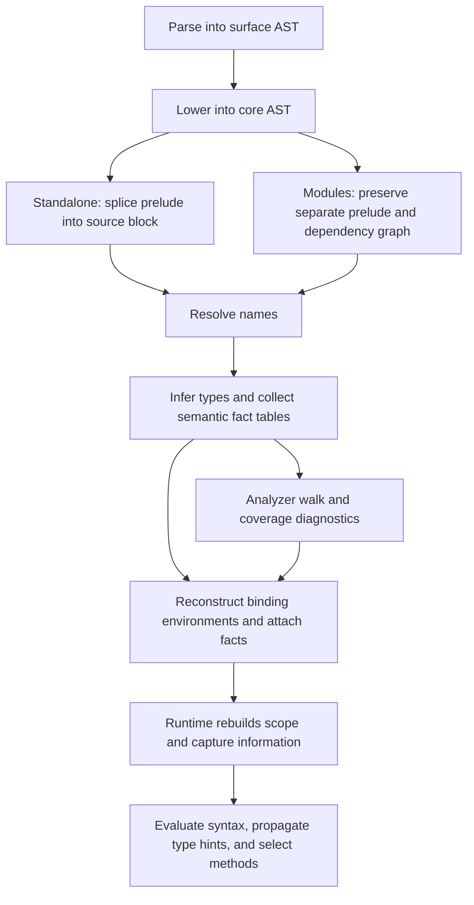

# Compiler architecture audit

Date: 2026-09-10

Source revision: `2695289b1e9a7555855eb6b00147a478ae010c6d`

Scope: `src/Jazz/Compiler`, with production-consumer searches in `src/` and `app/`

This report examines the compiler's representations, phase boundaries, and movement of program data. It records the code-based audit conducted in the associated discussion. It is an assessment and a set of recommendations, not an accepted design, implementation plan, or amendment to the public language contract.

The findings come from the current implementation and its call sites. Previous audits, architecture documents, roadmaps, and design decisions were not used as evidence. The report explains structural causes visible in the code; it does not establish when those choices were introduced or attribute them to particular contributors.

No compiler behavior was changed during the audit. Runtime and performance observations below describe code paths, not measured execution results. Relative source links below are live checkout links, with line numbers measured at the revision above; they are not immutable citations and may move as the implementation changes. Use the [pinned source tree](https://github.com/Un3qual/jazz/tree/2695289b1e9a7555855eb6b00147a478ae010c6d/src/Jazz/Compiler) for the archival snapshot.

## Assessment

The compiler is substantially more complicated than its basic algorithms require. The main cause is that stages repeatedly reconstruct decisions that earlier stages could have made explicit. Binding identity, recursion, implementation selection, and runtime representation remain partly implicit as programs move through the pipeline.

This produces a recurring pattern:

1. A feature needs information that the current representation does not express directly.
2. The implementation adds a table, preparation pass, or runtime hint.
3. Another stage reconstructs related information from names or expression shapes.
4. Additional machinery keeps the separate views consistent.
5. Caches, special execution paths, and invariant checks manage the resulting cost and fragility.

Many individual pieces are reasonable in isolation. Their composition is expensive because too many components must understand the same language rules.

The largest opportunities are to establish declaration identities once, preserve resolved binding structure, make checked expressions explicit about execution, complete the module-interface boundary, and reduce alternative program and runtime paths. Shorter functions, fewer files, or fewer Haskell extensions would not by themselves address these causes.

## Size and scope

The audited directory contains **88 Haskell files and 37,171 physical lines**. These counts include comments, blank lines, imports, and language pragmas; they are not executable-line counts.

| Area                                                   |  Files | Physical lines |    Share |
| ------------------------------------------------------ | -----: | -------------: | -------: |
| Type inference                                         |     19 |         10,807 |    29.1% |
| Runtime, including module execution and host interface |     14 |          7,920 |    21.3% |
| Parser and lowering                                    |     16 |          6,712 |    18.1% |
| Modules, driver, prelude, and source plumbing          |     15 |          5,337 |    14.4% |
| Analyzer, recursion, and pattern coverage              |      4 |          3,016 |     8.1% |
| Shared models, diagnostics, and utilities              |     20 |          3,379 |     9.1% |
| **Total**                                              | **88** |     **37,171** | **100%** |

Percentages are rounded independently. The runtime category contains `Runtime.hs`, `Runtime/`, `ModuleRuntime.hs`, and `RuntimeHost.hs`. Parser and inference categories include their corresponding root facade modules. The modules/plumbing category includes the remaining `Module*` files, `Driver`, prelude support, `SourceProgram`, and `SourceUnitOwnership`.

The largest files are:

| File                            | Lines | Main responsibility                                                                |
| ------------------------------- | ----: | ---------------------------------------------------------------------------------- |
| `Runtime/Engine.hs`             | 2,859 | Expression machine, scope evaluation, cells, host operations, and dispatch         |
| `TypeInference/Scope.hs`        | 2,347 | Declaration traversal, generalization, signatures, and recursive-group handling    |
| `TypeInference/Capabilities.hs` | 1,829 | Capability constraints, candidate selection, evidence, and runtime-hint prediction |
| `TypeInference.hs`              | 1,512 | Inference orchestration and expression checking                                    |
| `Parser/Expression.hs`          | 1,350 | Expression grammar and contextual boundary disambiguation                          |
| `Runtime/Semantics.hs`          | 1,266 | Runtime typing, matching, rendering, and numeric conversion                        |
| `Analyzer.hs`                   | 1,161 | Visibility, declaration checks, purity checks, and warnings                        |
| `Runtime/Primitives.hs`         | 1,060 | Builtin operations                                                                 |
| `ModuleResolver.hs`             |   994 | Discovery, graph construction, references, and exports                             |
| `Parser/Declaration.hs`         |   977 | Declaration grammar and expression/signature disambiguation                        |

The directory includes a substantial interpreter. A comparison with another Haskell compiler must account for differences in runtime, standard-library primitives, diagnostics, and supported semantics. No external compiler-size comparison was performed here. The architecture findings do not depend on such a comparison.

The basic unifier occupies a 428-line module. The much larger inference subsystem is primarily additional language semantics, scope management, evidence handling, state transport, and orchestration. This is an important distinction: the central issue is not an unusually elaborate unification algorithm.

## How programs move through the current implementation

The following diagram simplifies the production paths. Module discovery parses dependencies recursively, and diagnostic finalization contains several steps; the diagram emphasizes representation boundaries rather than every function call.



The important boundaries are:

| Boundary                  | Product                                                      | Important information still implicit or reconstructed later                                      |
| ------------------------- | ------------------------------------------------------------ | ------------------------------------------------------------------------------------------------ |
| Parsing                   | Surface expressions, statements, and signature payloads      | Some individual name locations; contextual declaration interpretation                            |
| Lowering                  | Phase-indexed core with node IDs                             | Many operator forms, declaration structure, and signature syntax                                 |
| Name resolution           | Names with origin, namespace, and spelling                   | Particular local declaration referenced; some unresolved-reference errors                        |
| Inference                 | Inference state, diagnostics, interface, and fact seeds      | Attachment of facts, binder identification for instantiation metadata, executable specialization |
| Analyzed attachment       | Same core shape with semantic facts and runtime plans        | Runtime binding preparation, closure captures, remaining method selection                        |
| Runtime scope preparation | Statement indexes, recursive groups, environments, and cells | Evaluation-time forcing, representation hints, and candidate matching                            |

Multiple passes are not inherently a problem. A compiler can have many simple passes with strong contracts. The weakness here is that too many passes revisit what a construct means instead of consuming the result of an earlier decision.

## Finding 1: local name resolution does not establish declaration identity

### Declaration identity evidence

[`ResolvedUserName`](../../src/Jazz/Compiler/Name.hs#L134) contains an origin, namespace, and identifier:

```haskell
data ResolvedUserName =
  ResolvedUserName ResolvedNameOrigin NameNamespace Identifier
```

There is no local declaration identity in that representation. Two local declarations with the same spelling have the same resolved name. Their occurrences remain distinguishable only through the environment reconstructed at each point in the program.

The resolver's main traversal constructs `Right (resolveExpr ...)`. Its unqualified-name fallback assigns `CurrentModule` even when lookup has not established an existing binding. Unbound-variable diagnostics belong to the later analyzer. See [`resolveExprNames`](../../src/Jazz/Compiler/ModuleResolver/Names.hs#L100) and [`collectExprDiagnostics`](../../src/Jazz/Compiler/Analyzer.hs#L291).

`CoreBinderId` exists, but ordinary variable references do not carry it. Binder IDs are reconstructed during semantic attachment for uses such as explicit-instantiation metadata. [`statementEnvironmentsByPath`](../../src/Jazz/Compiler/TypeInference/Analyzed.hs#L597) rebuilds visible binder environments and computes recursive groups during attachment.

The runtime environment remains [`Map ResolvedName RuntimeCell`](../../src/Jazz/Compiler/Runtime/Types.hs#L392).

### Cost of rediscovering declarations

The following components all participate in recovering binding relationships:

- The name resolver maintains visible names and recursive peers.
- The analyzer reconstructs lexical visibility for diagnostics.
- Type inference reconstructs environments and recursive binding seeds.
- Fact attachment reconstructs environments for binder identities.
- Unused-binding analysis maps references back to statement positions.
- Runtime scope preparation reconstructs recursive groups and binding names.
- Runtime execution builds prefix environments, recursive peer environments, and closure environments.

Some environments must remain separate: a type environment and a runtime-value environment store different things. The avoidable part is repeatedly deciding which declaration a reference denotes.

Consider two successive declarations named `x` with a closure defined between them. Every phase that reasons about that closure must reproduce the correct earlier-binding relationship. A resolved reference to a specific declaration would preserve the answer directly.

### Resolve references to declaration identities

Allocate stable declaration identities during binding resolution and put those identities on resolved references. Keep source spelling, namespace, and source location as metadata for diagnostics and display.

Resolve shadowing, forward references, and recursive dependencies at that boundary. Later phases should consume binding identities and relationships rather than reconstruct them from names.

This is the broadest simplification opportunity because it affects inference, diagnostics, imports, closure capture, unused-binding analysis, and runtime environments.

## Finding 2: lowering preserves too much source-level structure

### Preserved surface forms

The surface/core split performs useful transformations. Multiple lambda parameters and pattern lambdas become simpler forms. However, [`Expr`](../../src/Jazz/Compiler/AST.hs#L147) and [`Statement`](../../src/Jazz/Compiler/AST.hs#L184) preserve many source-level distinctions through the analyzed phase:

- Operator values and textual binary operators.
- Left and right sections.
- Explicit type applications carrying signature syntax.
- Separate signature statements.
- Class and implementation declarations.
- Module/import statements in the standalone path.

The lowerer converts infix `$` to application, but otherwise directly preserves binary operators and sections. See [`lowerSurfaceExprWithoutCostCentre`](../../src/Jazz/Compiler/Parser/Lower.hs#L430).

Expression inference recognizes ordinary applications, builtin operator application spines, operator aliases, section application fallbacks, and qualified-method applications. Runtime values and continuation frames retain corresponding distinctions.

### Cost of repeated syntax interpretation

The same operation can reach later stages through several syntactic forms. Those stages repeatedly identify equivalent operations and account for aliases and partial application.

For an analyzed operator use, runtime code still decides whether the textual symbol denotes a builtin or requires lookup of a hidden operator binding. Analysis has not turned that distinction into a final executable choice.

The problem is not the number of constructors alone. A primitive operation, a short-circuiting construct, or an explicit coercion can justify a dedicated core node. The issue is preserving distinctions without consistently resolving them into semantic operations.

### Normalize resolved execution forms

Make the checked execution representation identify resolved callables, selected primitives, explicit representation adjustments, and the binding groups needed for execution.

Normalize equivalent surface forms when their meaning is known. Preserve evaluation order and special primitive semantics explicitly rather than assuming every operator can be replaced by an ordinary application.

This could be achieved by strengthening the existing analyzed representation. Adding a fourth representation while retaining all current adapters would initially increase the problem.

## Finding 3: capability dispatch is split between overlapping static and runtime systems

### Static and runtime selection evidence

[`selectQualifiedMethodCandidate`](../../src/Jazz/Compiler/TypeInference/Capabilities.hs#L1256) tries implementations, computes compatible matches, prefers exact matches, and records selected evidence.

Exact matching can depend on the argument expression as well as its inferred type. The helpers beginning around [`scalarApplicationRuntimeHint`](../../src/Jazz/Compiler/TypeInference/Capabilities.hs#L1395) inspect applications, lists, constructors, conditionals, cases, and blocks. They maintain local hints and associate signatures with bindings to predict runtime representation.

Runtime qualified-method values retain a method signature, a class type variable, candidate implementations, and captured arguments. [`preferredRuntimeMethodCandidates`](../../src/Jazz/Compiler/Runtime/Semantics.hs#L1178) independently filters compatible candidates and prefers exact candidates. [`applyQualifiedMethodWithHost`](../../src/Jazz/Compiler/Runtime/Engine.hs#L2573) can report no matching body or ambiguous bodies.

Compiler-selected evidence is used: runtime `SupplyEvidence` filters the candidate collection. The issue is therefore an incomplete handoff, not a complete absence of static information.

### Cost of overlapping dispatch

Inference must understand runtime hint behavior, while runtime must understand signatures, compatibility, candidate precedence, evidence, and partial application.

The runtime representation of values becomes part of the static selection algorithm. A change to how list hints or numeric targets survive an application can require changes to both the runtime and the compiler's prediction of the runtime.

This is a particularly expensive form of coupling because behavior can depend on expression shape even after types have been inferred.

### Separate settled and dynamic dispatch

Distinguish decisions that are settled statically from selection that intentionally remains dynamic.

For statically settled calls, carry a selected implementation or explicit dictionary/method argument. For intentionally dynamic behavior, use a clearly represented dynamic-dispatch operation whose runtime semantics have one owner.

Do not assume dictionary elaboration automatically preserves all current behavior. The implementation's exact-match preferences and representation-sensitive choices must be understood before replacing them. The desired architectural property is a clear handoff rather than two partially overlapping selection systems.

## Finding 4: semantic attachment reconstructs information instead of simply finalizing it

### Fact publication and attachment evidence

[`InferenceOutput`](../../src/Jazz/Compiler/TypeInference/State.hs#L128) contains six semantic side tables keyed by node identity:

1. Expression types.
2. Binary operation selections.
3. Expression evidence seeds.
4. Explicit-instantiation seeds.
5. Pattern fact seeds.
6. Statement fact seeds.

It also contains invariant failures, diagnostics, deferred constraints, and coverage sites.

The 650-line [`TypeInference/Analyzed.hs`](../../src/Jazz/Compiler/TypeInference/Analyzed.hs#L178) traverses the expression again, looks up facts, resolves types, reconstructs binder environments, projects schemes, and builds runtime obligations. It detects missing and inconsistent entries through a dedicated attachment result type and semantic-invariant failure vocabulary.

[`ExpressionFacts`](../../src/Jazz/Compiler/SemanticFacts.hs#L121) carries the semantic type, binary operation information, numeric constraints, instantiations, evidence, and a runtime plan.

Production-consumer searches in `src/` and `app/` found the runtime reading `expressionRuntimePlan`, while several other expression fact fields had no separate field reads outside their construction machinery. Pattern facts are also attached without driving runtime pattern matching. This observation concerns direct field consumers; it does not exclude generic `Show`, equality, forcing, or test use.

### Cost of reconstructing checked meaning

A final substitution/finalization pass is normal in type inference. Node-indexed fact tables can also be appropriate. Here, attachment goes further: it reconstructs semantic relationships that were not retained as the direct result of checking.

The compiler pays for a rich analyzed description while the evaluator still reconstructs important execution information from syntax.

The attached runtime plan introduces another small language:

```text
InstantiateTypes
SupplyEvidence
SpecializeNumericLiteral
ConstrainResult
```

Runtime code splits callable preparation from result obligations, wraps values in annotations, propagates type hints, and accumulates return obligations. See [`RuntimeObligation`](../../src/Jazz/Compiler/SemanticFacts.hs#L95) and [`applyExpressionRuntimePlan`](../../src/Jazz/Compiler/Runtime/Engine.hs#L2096).

Execution therefore depends on both an expression tree and an ordered annotation protocol. The invariants between them are a significant maintenance burden.

### Construct facts during checking

Have checking produce an expression with its required semantic relationships already attached. Retain a straightforward finalization pass for substitutions and finalized schemes.

Make execution decisions explicit in the representation consumed by runtime. Keep inspection metadata where it has a concrete consumer, but distinguish it from required execution semantics.

Do not delete fact validation merely because it is lengthy. First change the representation so fewer consistency conditions need to be reconstructed and checked.

## Finding 5: recursive binding semantics require expensive machinery, and the architecture repeats it

### Repeated recursive scope discovery

[`inferRecursiveGroupsOrderedInternal`](../../src/Jazz/Compiler/RecursiveBindings.hs#L456) does substantially more than pass a graph to `stronglyConnComp`. Dependencies depend on earlier rebindings, outer bindings, forward references, alias-shaped initializers, and whether an expression can produce a function.

Other helpers distinguish syntactic self-reference from references that should own a recursive runtime cell. `RecursiveBindings.hs` also maintains lexical contexts for inspecting expressions through bindings and aliases.

Scope inference adds support for recursive groups whose definitions are interleaved with other bindings. It maintains group intervals, sweep positions, group-start states, and a preview cache. See [`ScopeWalkState`](../../src/Jazz/Compiler/TypeInference/Scope.hs#L433) and [`exposeVisibleRecursiveGroupSchemes`](../../src/Jazz/Compiler/TypeInference/Scope.hs#L1317).

[`previewRecursiveGroupState`](../../src/Jazz/Compiler/TypeInference/Scope.hs#L1511) performs inference on later group members to expose temporary schemes. Cache validity depends on substitutions and numeric/equality constraints. [`rollbackPreviewState`](../../src/Jazz/Compiler/TypeInference/Scope.hs#L1577) restores the original state while preserving the type-variable allocation watermark.

Runtime introduces additional shape-sensitive work: following aliases through selected branches, evaluating conditions or guards during alias selection, building block-local alias environments, and attaching self references to returned closures. See [`attachSelfRecursiveBinding`](../../src/Jazz/Compiler/Runtime/Engine.hs#L703), [`selectedRecursiveAliasTarget`](../../src/Jazz/Compiler/Runtime/Engine.hs#L743), and [`blockLocalAliasEnv`](../../src/Jazz/Compiler/Runtime/Engine.hs#L890).

### Cost of repeated binding analysis

This complexity has two sources that should not be conflated.

First, sequential rebinding, forward recursion, interleaved definitions, generalization, and callable-producing initializers are a demanding combination of language behaviors. Supporting them has an inherent cost.

Second, the compiler repeatedly infers their relationships from names and syntax. The results do not become a persistent binding structure consumed by every later stage.

The existing `PreparedRecursiveScope` does share work between some analyzer and inference paths. That is a useful local improvement. It does not establish a single resolved representation of recursion for the entire pipeline.

### Publish resolved recursive structure

Resolve declaration identities, dependency edges, and recursive groups once. Keep type-checking dependency order distinct from source evaluation order so a refactor does not accidentally reorder effects or rebindings.

Represent recursive cells explicitly enough that runtime does not have to rediscover group ownership from expression shape wherever possible.

Do not assume all preview inference can be deleted while retaining the current generalization behavior. Removing the preview mechanism may require restricting or redefining interleaved recursion. That is a language-design decision, separate from representational cleanup.

## Finding 6: runtime scope execution uses two different cell strategies

### Pure and host cell strategies

The runtime has a shared explicit expression machine. Its [`EvaluationFrame`](../../src/Jazz/Compiler/Runtime/Engine.hs#L400) representation is a reasonable mechanism for keeping Jazz recursion off the Haskell call stack.

The split is around scope execution.

[`evaluateRuntimeScopePureRequest`](../../src/Jazz/Compiler/Runtime/Engine.hs#L509) constructs lazy binding cells and prefix environments. Haskell laziness participates in tying recursive environments together.

Host execution uses explicit deferred binding identities, evaluating/evaluated states, and a cache. See [`Runtime/Types.hs`](../../src/Jazz/Compiler/Runtime/Types.hs#L113).

[`evalScopeWithHostInstance`](../../src/Jazz/Compiler/Runtime/Engine.hs#L2237) routes eligible statement chunks back through pure scope evaluation. Routing accounts for whether environments may reach host cells, recursive-group requirements, observation settings, and prelude statement-index remapping.

Observation changes eligibility for pure chunks. Profiling and statistics are therefore connected to execution-strategy selection, not solely to recording events.

### Cost of parallel scope execution

The runtime must preserve compatible behavior across two cell strategies and their transitions. This requires host-cell provenance flags, deferred-cell cache coordination, pure-chunk selection, and separate handling of several binding cases.

Supporting IO is not itself the problem. The cost comes from maintaining the pure/host split while allowing values and closures to move between paths.

There are not two completely independent expression interpreters; both paths use the shared machine. The scope and cell machinery is the duplication target.

### Share scope execution and measure storage

Evaluate whether one explicit cell model can serve both paths: unevaluated, evaluating, and evaluated cells, with one memoization and recursive-forcing policy.

Retain the stack-safe machine and host-operation abstraction. Make observation record execution without selecting a separate semantic path wherever feasible.

The existing fast paths may have performance value. Removing them requires representative measurements; this static audit does not establish that they are unnecessary or that a unified cell model will be faster.

## Finding 7: standalone and module compilation use different program representations

### Standalone and module program paths

[`mergePreparedPrelude`](../../src/Jazz/Compiler/Driver.hs#L643) prepends prelude statements to standalone source and records which statement positions came from the prelude. The combined source is reindexed, resolved, analyzed, and evaluated as an expression/source unit.

[`buildAnalyzedProgram`](../../src/Jazz/Compiler/Driver.hs#L547) keeps the prelude as a separate artifact, resolves a module graph, and analyzes modules against dependency interfaces.

The distinction reaches [`SourceUnitOwnership`](../../src/Jazz/Compiler/SourceUnitOwnership.hs#L70), which models an injected prelude's evidence ownership separately from the origin used for runtime names. Ownership can depend on statement indices and the authored module declaration.

Module lowering removes module/import forms from executable statements and puts them in graph metadata. The standalone path retains statement forms that later capability and ownership folds must interpret.

### Cost of positional prelude ownership

These are two internal models of a program, not just convenience wrappers around one operation.

Hidden-statement indices, prelude-statement indices, injected ownership, module-origin transitions, and related special cases are threaded through multiple stages to preserve the distinction.

This also makes it harder to guarantee that compiling the same definitions through standalone and module entry points exercises the same semantic boundaries.

### Use one program construction path

Represent standalone source as a synthetic module using the same program construction and prelude mechanism as named modules.

Preserve source-origin and diagnostic-visibility metadata directly. Keep the entry-module versus dependency-module evaluation policy explicit.

The unified representation must preserve existing standalone behavior; changing how the prelude is represented should not silently change source visibility, evidence ownership, diagnostics, or evaluation order.

## Finding 8: module interfaces expose inference representations and incomplete identity

### Interface and dependency sidecar evidence

[`ModuleInterface`](../../src/Jazz/Compiler/ModuleInterface.hs#L51) depends directly on `TypeInference.Types`. Its exported information includes inference bindings, class method signatures, implementation facts, and implementation method types.

The transported representations retain several forms of unfinished normalization:

- [`ConstructorArgumentType`](../../src/Jazz/Compiler/TypeInference/Types.hs#L84) has monomorphic, parameter, structured-signature, and fresh-variable variants.
- `ClassMethodType` retains a resolved signature payload.
- `ImplMethodType` retains resolved signature syntax.
- [`TypeScheme`](../../src/Jazz/Compiler/TypeInference/Types.hs#L169) carries defining capability facts.
- `TypeBinding` distinguishes ordinary schemes from several builtin/operator alias forms.

Importing traverses and rebases types, schemes, constructors, constraints, capability facts, method keys, signatures, and evidence candidates. See [`rebaseTypeBinding`](../../src/Jazz/Compiler/ModuleAnalysis.hs#L436) and the following rebasing functions.

The nominal interface is also incomplete as the actual dependency boundary. [`dependencyImportInterface`](../../src/Jazz/Compiler/ModuleAnalysis.hs#L240) takes four products:

```text
ModuleExportInventory
ModuleInterface
Map ModuleExport CoreBinderId
Map Text [ImplementationEvidenceCandidate]
```

Binder inventories and evidence candidates are obtained separately from module artifacts.

Identity is represented inconsistently. Structured names coexist with textual class/method keys. [`ConcreteImplFact`](../../src/Jazz/Compiler/CapabilityFacts.hs#L102) equality and ordering use rendered names and rendered signature types. Semantic code must qualify, split, and prefix-match names.

### Cost of incomplete module publication

Importers need knowledge of inference bookkeeping and signature representation. Adding a new field or form can require a new rebasing path, interface projection, or side inventory.

Relative identities force semantic objects to be rewritten when crossing module boundaries. Parallel textual and structural identities create additional consistency requirements.

The interface boundary therefore transports more implementation detail while failing to transport all the finalized facts an importer needs.

### Publish complete semantic interfaces

Export normalized semantic declarations and schemes with stable defining-module identities. Include required binder and implementation evidence information in the actual interface product.

Keep source aliases and accessible diagnostic spellings as lookup/display concerns. Import selection still needs filtering, and private constructors still affect visibility and coverage. Those responsibilities do not require recursively renaming already canonical semantic identities.

Use structural identity consistently for capabilities, methods, and implementations. Rendering should serve diagnostics rather than define semantic equality.

## Finding 9: parser complexity combines mixed control flow, grammatical ambiguity, and lost information

### Evidence: mixed parser control

The parser uses both Megaparsec parsers and functions returning `(value, remainingTokenStream)` in `Either ParserFailure`.

[`parseStatementParser`](../../src/Jazz/Compiler/Parser/Declaration.hs#L174) adapts expression parsers into token-stream callbacks, invokes declaration parsing, and consumes the calculated prefix back into Megaparsec. The nearby `parseOwnedPrefix` and `consumeParsedPrefix` helpers expose this boundary directly.

### Evidence: syntax-dependent disambiguation

[`shouldParseQualifiedAliasStatement`](../../src/Jazz/Compiler/Parser/Declaration.hs#L871) decides whether a form is a signature or qualified expression using adjacency, known aliases, parsed signature shape, and whether the following statement binds the same name.

[`caseArmPipeStartsBoundary`](../../src/Jazz/Compiler/Parser/Expression.hs#L861) handles `|` as an expression operator, pattern alternative, and arm boundary. The surrounding functions use precedence, expression shape, lookahead, guards, and pattern parsing to determine where an expression ends.

### Evidence: information recovered downstream

Signature type nodes do not retain all individual name spans. [`locateQualifiedClassReferences`](../../src/Jazz/Compiler/ModuleResolver.hs#L909) scans tokens again to locate qualified class references for diagnostics.

Unsupported signatures can survive parsing as token payloads. [`signaturePayloadConstraintType`](../../src/Jazz/Compiler/CapabilityFacts.hs#L157) includes recovery of type structure from some of these payloads, while other signature handling rejects unsupported forms later.

### Cost of mixed parser ownership

Parser adapters and callback boundaries add mechanical complexity. Ambiguity adds real grammatical complexity. Missing location data causes additional passes, and signature fallbacks allow syntax processing to extend into semantic code.

These are different problems. Replacing Megaparsec would not eliminate ambiguity or recover information the AST discards.

### Unify parser control and retain locations

Use one parser control model consistently. Preserve required source spans in parsed nodes. Normalize accepted signature forms once, and keep diagnostic recovery separate from semantic type interpretation.

Treat grammatical simplification as a separate language decision. Changing separators, adjacency rules, or contextual disambiguation could remove significant code, but would change accepted programs and cannot be categorized as an ordinary refactor.

## Finding 10: navigation follows overlapping responsibilities rather than clear phase contracts

### Overlapping coordinator responsibilities

The code is divided into modules, but module names do not identify a single clear owner for several central decisions:

- `ModuleCompiler.analyzeProgram` orchestrates module inference.
- `TypeInference` invokes `Analyzer` after inference through [`finishInference`](../../src/Jazz/Compiler/TypeInference.hs#L389).
- [`Analyzer.AnalysisResult`](../../src/Jazz/Compiler/Analyzer.hs#L106) contains an `analyzedExpr` that is still `Expr 'Resolved`.
- `TypeInference.Analyzed` creates the actual analyzed expression.
- `Runtime.ScopePlan` reconstructs binding and recursion information.
- `Runtime.Semantics` covers rendering, pattern matching, runtime typing, candidate selection, and numeric conversions.

`TypeInference/Scope.hs` contains a very large function with many nested helpers sharing lexical state. Moving each helper into another file would not remove the shared assumptions.

There are smaller signs of unclear contracts. [`inferExprTypeDetailedWithMode`](../../src/Jazz/Compiler/TypeInference.hs#L631) ignores its mode argument while scope paths inspect the mode. Callers cannot infer the actual distinction from the signature alone.

### Cost of navigating ownership protocols

Understanding a behavior requires following several modules whose names suggest stronger phase boundaries than they provide. A question such as "where is a reference finally resolved?" has no single satisfying answer.

Large modules are a symptom, but file count is not a useful simplification target on its own. More small modules can preserve exactly the same conceptual coupling.

### Clarify phase ownership before moving files

Give each semantic decision one owner and state its output invariant in the relevant type/API. Organize files around those responsibilities after the boundaries become real.

Remove or narrow compatibility modes and adapters when their actual consumers no longer justify them. This should follow call-site verification, not a blanket deletion of all wrappers or callbacks.

## Cross-cutting causes

| Representation or design choice                                  | Downstream complexity                                       |
| ---------------------------------------------------------------- | ----------------------------------------------------------- |
| Local references retain spelling instead of declaration identity | Repeated lexical environment reconstruction                 |
| Analyzed core preserves source distinctions                      | Repeated operator, alias, and application-shape recognition |
| Semantic facts are accumulated separately from the checked tree  | Attachment, projection, and invariant machinery             |
| Dispatch is partially static and partially implicit at runtime   | Overlapping selection algorithms and type-hint prediction   |
| Binding groups are recovered from syntax in several phases       | Recursive previews and shape-sensitive runtime preparation  |
| Pure and host scopes use different cell strategies               | Routing, provenance, chunking, and cache coordination       |
| Standalone source splices in prelude statements                  | Statement-index ownership and visibility bookkeeping        |
| Interfaces retain syntax and relative names                      | Repeated normalization, qualification, and rebasing         |
| Parsed nodes omit information required by diagnostics            | Token rescans and reconstruction                            |

The code supports an explanation of incremental feature growth around representations that were not strengthened enough as the language grew. This is a structural inference from the current implementation, not a claim about project history.

The resulting complexity is multiplicative. A new construct that affects binding, capabilities, or runtime representation may require changes to parsing, name resolution, inference, semantic attachment, interface rebasing, and runtime interpretation. The problem is the number of semantic owners involved, not merely the number of files touched.

## Complexity worth retaining

The audit does not justify deleting every substantial subsystem. Several choices have clear purposes in the current code:

- **Surface/core separation:** it keeps parsing concerns distinct and already performs useful lowering.
- **Phase safety:** the phase index prevents accidental mixing of lowered, resolved, and analyzed values.
- **Structured diagnostics and source locations:** they support useful user-facing errors and warnings.
- **Module interfaces and export visibility:** separate modules need a deliberate semantic boundary.
- **Pattern coverage:** exhaustiveness and usefulness analysis require real algorithms and constructor information.
- **The explicit expression machine:** it provides stack-safe language execution.
- **Host-operation abstraction:** it separates language execution from external operations.
- **Numeric semantics:** fixed-width integers, conversion, range behavior, and multiple floating-point targets require implementation work.
- **Measured optimizations:** cached indexes, ordered collections, or strictness boundaries can be appropriate where they solve demonstrated costs.

`Map`, `Set`, `Seq`, newtypes, and Haskell language extensions are not the central source of over-engineering. Replacing them indiscriminately would obscure the actual issues.

Likewise, a final type-substitution pass, distinct type/value environments, and separate diagnostic analysis are not inherently redundant. The goal is to stop them from independently recovering the same semantic relationships.

## Recommended simplification sequence

These are directions for subsequent design and implementation, not an approved delivery plan. Each step should replace existing responsibility rather than add a permanent parallel layer.

### 1. Establish declaration identities and resolved binding groups

Start by tracing shadowing, forward references, and recursive declarations through resolution. Give every reference a stable declaration identity and record resolved dependencies.

The acceptance condition is concrete: after resolution, later stages do not need to rediscover which declaration a reference denotes.

Preserve source names for diagnostics, source evaluation order, and the distinctions needed by existing recursion rules. Unique IDs alone will not settle all generalization policy.

### 2. Unify program construction

Represent standalone source using the same module/program carrier and prelude mechanism as named modules.

The acceptance condition is removal of positional prelude ownership reconstruction from later phases, with equivalent visibility, diagnostic origin, evidence ownership, and evaluation behavior.

### 3. Normalize declarations and complete interfaces

Convert accepted signatures and declaration metadata into semantic forms at a deliberate boundary. Give global declarations stable defining identities. Include the facts importers actually require in one interface product.

The acceptance condition is that importing does not require a family of syntax- and inference-specific rebasing functions or separately rediscovered evidence inventories.

### 4. Make checked expressions explicit about execution

Represent selected primitives, statically chosen methods, explicit dynamic dispatch, type/representation adjustments, and execution-relevant binding structure directly.

The acceptance condition is that runtime follows these decisions without repeating compiler selection logic or needing the compiler to predict value hints through source expression shapes.

Retain inspection metadata deliberately. Do not preserve the old attachment protocol indefinitely alongside its replacement.

### 5. Consolidate scope and cell execution

Evaluate a single explicit cell model with the existing expression machine. Separate host operations and observation from the choice of binding semantics.

The acceptance condition is one coherent forcing, recursion, and memoization model across pure and host execution. Measure performance before retiring fast paths.

### 6. Standardize parser control and location ownership

Use one parser model internally, preserve required source locations, and stop semantic stages from recovering accepted type syntax from fallback tokens.

The acceptance condition is simpler control flow and fewer reconstruction passes with unchanged accepted syntax and diagnostic behavior. Any grammar simplification should be proposed separately as a language change.

## Behavior-preserving refactors versus language decisions

| Proposal                                                   | Intended category                              | Constraint                                                         |
| ---------------------------------------------------------- | ---------------------------------------------- | ------------------------------------------------------------------ |
| Stable declaration identities                              | Representation refactor                        | Preserve shadowing, forward-reference, and recursion meaning       |
| Persist resolved dependencies and groups                   | Representation refactor                        | Separate checking dependencies from evaluation order               |
| Normalize module identities and exported schemes           | Boundary refactor                              | Preserve exports, private-type visibility, and diagnostic spelling |
| Represent standalone input as a synthetic module           | Program-construction refactor                  | Preserve prelude and standalone behavior                           |
| Standardize parser control and retain spans                | Parser refactor                                | Preserve contextual grammar and error behavior                     |
| Replace statically settled selection with direct evidence  | Elaboration refactor                           | Prove equivalence of selection and partial application             |
| Consolidate runtime cells                                  | Execution refactor with performance risk       | Preserve forcing, effects, recursion errors, and observation       |
| Remove interleaved-recursion previews                      | Potential language decision                    | Current generalization behavior may require them                   |
| Simplify pipe syntax and signature/qualification ambiguity | Language decision                              | Accepted programs may change                                       |
| Remove representation-sensitive dispatch rules             | Language decision unless equivalence is proven | Current candidate precedence is observable                         |

This separation prevents an architectural cleanup from silently becoming a language redesign.

## Validation for subsequent changes

No behavior or performance claims in this report were validated by running the compiler. This was a static architecture audit. Implementation work should use representative semantic cases rather than tests that merely mirror new helper functions.

The most important existing behaviors to protect are:

- A closure referring to an earlier binding when a later declaration reuses its spelling.
- Self and mutual recursion, including aliases and callable-producing wrappers.
- Recursive group members separated by other bindings, with their current generalization behavior.
- Standalone versus module execution with bundled, explicit, or absent preludes.
- Imported values, constructors, capabilities, private declarations, and qualified names.
- Method selection involving partial application, explicit type application, lists, constructors, numeric targets, and inferred constraints.
- Pure and host execution with deferred values, recursive forcing, and observation enabled or disabled.
- Parser cases where signatures, qualification, operators, pattern alternatives, and guards interact.

Useful measurements would compare compilation allocation and runtime execution on representative programs, especially recursion-heavy and capability-heavy cases. They would determine which existing caches and fast paths should survive a simpler representation.

There is no defensible exact line-reduction estimate from this audit. The affected subsystems overlap, and replacement representations also cost code. A credible estimate should follow a bounded implementation that demonstrates actual deletion of repeated responsibility.

## Suggested first milestone

Resolve one representative family of shadowed and recursive bindings into declaration identities, then carry those identities through checking, diagnostics, and execution.

Measure success by removing the need for later phases to determine binding meaning again. That targets the architectural cause of the complexity and creates a foundation for simplifying interfaces, captures, recursion preparation, and runtime environments.
